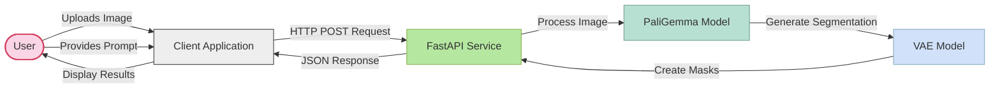
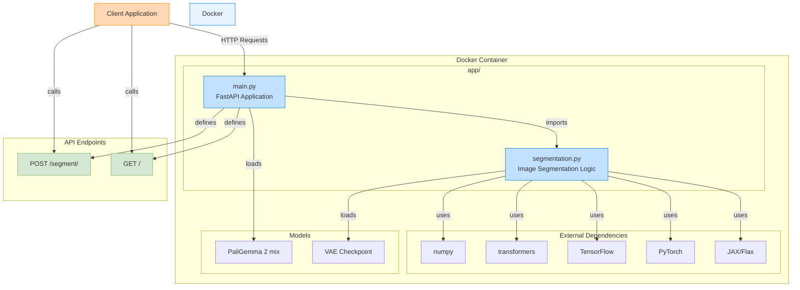

# PaliGemma-Image-Segmentation

An app for performing image segmentation with PaliGemma 2 mix

---

- transformers, JAX/Flax -> PaliGemma 2 mix
- Docker
- FastAPI

---

Structure:

```
project_folder/
├── app/
│   ├── main.py
│   └── segmentation.py
├── models/
│   └── vae-oid.npz
├── .dockerignore
├── .gitignore
├── Dockerfile
├── README.md
└── requirements.txt
```

---

Workflow Overview:



App Architecture:



# Example:

Request:

```bash
curl -X 'POST' \
  'http://localhost:8000/segment' \
  -H 'accept: application/json' \
  -H 'Content-Type: application/x-www-form-urlencoded' \
  -d 'prompt=segment%20left%20wheel&image_url=https%3A%2F%2Fhuggingface.co%2Fdatasets%2Fhuggingface%2Fdocumentation-images%2Fresolve%2Fmain%2Ftransformers%2Ftasks%2Fcar.jpg'
```

Response:

<details>
  <summary>Show JSON</summary>

```json
{
  "masks": [
    {
      "bbox": [
        62,
        254,
        140,
        348
      ],
      "mask": [
        [
          -1.0188672542572021,
          -1.0161534547805786,
          -1.0120995044708252,
          -1.0129673480987549,
          -1.0101863145828247,
          -1.0116374492645264,
          -1.013303279876709,
          -1.0066723823547363,
          -1.0047223567962646,
          -0.9953238368034363,
          -0.9858508706092834,
          -0.9824640154838562,
          -0.9684506058692932,
          -0.9763135313987732,
          -0.9796698689460754,
          -0.9755039811134338,
          -0.9587529301643372,
          -0.9615097641944885,
          -0.9694676995277405,
          -0.9631097912788391,
          -0.9687903523445129,
          -0.9689903855323792,
          -0.9604806303977966,
          -0.9470844864845276,
          -0.9007871747016907,
          -0.8302652835845947,
          -0.7384381294250488,
          -0.6223242878913879,
          -0.5047735571861267,
          -0.3531220555305481,
          -0.2405179888010025,
          -0.09471641480922699,
          0.02454368770122528,
          0.1716700941324234,
          0.29247379302978516,
          0.3602932095527649,
          0.3216085433959961,
          0.131211057305336,
          -0.10890908539295197,
          -0.4072797894477844,
          -0.7039684653282166,
          -0.889109194278717,
          -1.0001347064971924,
          -1.0114331245422363,
          -1.0070116519927979,
          -0.9940044283866882,
          -0.9895769953727722,
          -0.9972770810127258,
          -1.0102832317352295,
          -0.9989442229270935,
          -0.9958253502845764,
          -1.0035784244537354,
          -1.008446455001831,
          -1.001536250114441,
          -0.9971774220466614,
          -1.0048651695251465,
          -0.9916316866874695,
          -0.9927279353141785,
          -0.9966180920600891,
          -0.9899455904960632,
          -0.9937871098518372,
          -0.9990130066871643,
          -1.0081074237823486,
          -1.014171838760376
        ],
        [
          -1.011401891708374,
          -1.0072717666625977,
          -1.0085082054138184,
          -1.0105363130569458,
          -1.0132393836975098,
          -1.0092506408691406,
          -1.006312608718872,
          -1.0030615329742432,
          -0.9986777901649475,
          -0.99335116147995,
          -0.987644374370575,
          -0.9712997078895569,
          -0.9717839360237122,
          -0.9668561816215515,
          -0.966841995716095,
          -0.9550808072090149,
          -0.9470365643501282,
          -0.9539509415626526,
          -0.9548138976097107,
          -0.9409562945365906,
          -0.9340389370918274,
          -0.8301565051078796,
          -0.5967956185340881,
          -0.24466119706630707,
          0.02930121123790741,
          0.28767120838165283,
          0.47197824716567993,
          0.6071717143058777,
          0.7349339127540588,
          0.8184608817100525,
          0.8522477746009827,
          0.9039122462272644,
          0.8925159573554993,
          0.9476572275161743,
          0.9769458770751953,
          0.9777526259422302,
          0.9841799736022949,
          0.954606831073761,
          0.9198440909385681,
          0.8083363175392151,
          0.6280719637870789,
          0.22570408880710602,
          -0.2761281132698059,
          -0.7558684945106506,
          -0.9430877566337585,
          -0.9927874207496643,
          -1.0086978673934937,
          -0.9965812563896179,
          -1.0031991004943848,
          -1.00031578540802,
          -0.9971590638160706,
          -0.997444212436676,
          -1.0025606155395508,
          -0.9944879412651062,
          -0.9948918223381042,
          -0.9982884526252747,
          -0.9981701970100403,
          -0.9916682839393616,
          -0.9980317950248718,
          -0.9919188618659973,
          -0.9947842955589294,
          -0.9942646622657776,
          -0.9990753531455994,
          -1.0054240226745605
        ],
        [
          -1.0052732229232788,
          -0.9989331364631653,
          -1.0033237934112549,
          -1.0050642490386963,
          -1.0067914724349976,
          -1.0011577606201172,
          -1.0013209581375122,
          -1.0051196813583374,
          -1.0005199909210205,
          -0.9992905259132385,
          -0.9992939829826355,
          -0.9805219769477844,
          -0.9615758061408997,
          -0.9134876132011414,
          -0.8823990225791931,
          -0.8538524508476257,
          -0.8270226716995239,
          -0.8437333703041077,
          -0.763063371181488,
          -0.5950285792350769,
          -0.3104798197746277,
          0.20686458051204681,
          0.5902386903762817,
          0.8296647667884827,
          0.9239787459373474,
          0.9621372222900391,
          0.984943151473999,
          0.983786404132843,
          0.999067485332489,
          0.9992801547050476,
          0.9979323744773865,
          0.9906178116798401,
          0.9980635643005371,
          1.0024335384368896,
          0.9967275857925415,
          1.0033165216445923,
          1.01109778881073,
          1.0116428136825562,
          1.0050123929977417,
          0.9938779473304749,
          0.9770789742469788,
          0.9833151698112488,
          0.8863357901573181,
          0.5946322679519653,
          0.11238612234592438,
          -0.5413066744804382,
          -0.8761534094810486,
          -0.994711697101593,
          -0.9967328906059265,
          -0.9855995774269104,
          -0.9845755696296692,
          -0.9951614737510681,
          -0.9996518492698669,
          -0.9968200325965881,
          -0.9923631548881531,
          -0.9986847043037415,
          -0.9965723156929016,
          -0.9986557364463806,
          -1.0000646114349365,
          -0.9957348704338074,
          -1.0009324550628662,
          -1.0024409294128418,
          -1.0018985271453857,
          -1.0076266527175903
        ],
        [
          -1.0078747272491455,
          -1.0033680200576782,
          -1.0005834102630615,
          -1.0000362396240234,
          -1.006772756576538,
          -1.0036908388137817,
          -1.001556396484375,
          -1.0061880350112915,
          -1.0011900663375854,
          -1.0032137632369995,
          -0.9906119704246521,
          -0.9468647837638855,
          -0.7534534931182861,
          -0.4106059670448303,
          -0.1560417264699936,
          -0.044520094990730286,
          0.05228322744369507,
          0.18081913888454437,
          0.32960623502731323,
          0.5396867394447327,
          0.7790616154670715,
          0.9193217158317566,
          0.9714942574501038,
          0.9734450578689575,
          0.993659496307373,
          0.9942524433135986,
          0.9884768128395081,
          0.9977673292160034,
          0.99635249376297,
          1.000868558883667,
          0.9934155941009521,
          0.9985279440879822,
          0.9958339333534241,
          0.9988712668418884,
          0.9899380207061768,
          0.9983227252960205,
          0.9964722990989685,
          1.0047861337661743,
          0.9957939982414246,
          0.9975929260253906,
          0.9940192103385925,
          1.009196162223816,
          1.0171865224838257,
          0.9909451603889465,
          0.9396904110908508,
          0.7305600643157959,
          0.1734514981508255,
          -0.5839024186134338,
          -0.940675675868988,
          -0.9864428639411926,
          -0.9965705275535583,
          -1.0079764127731323,
          -1.0108225345611572,
          -0.9973300099372864,
          -0.9922947287559509,
          -0.9929566979408264,
          -0.994691789150238,
          -0.9967237114906311,
          -0.998047411441803,
          -1.0015740394592285,
          -1.0006752014160156,
          -1.0020647048950195,
          -1.0005269050598145,
          -1.0031852722167969
        ],
        [
          -1.0047049522399902,
          -1.004077672958374,
          -1.0079561471939087,
          -1.0052794218063354,
          -1.0055149793624878,
          -1.005300760269165,
          -1.0030635595321655,
          -1.0057690143585205,
          -1.000925898551941,
          -0.9888303875923157,
          -0.9442630410194397,
          -0.5441053509712219,
          0.11051876842975616,
          0.5970138311386108,
          0.7867987751960754,
          0.8195543885231018,
          0.8717243671417236,
          0.8847388625144958,
          0.9340973496437073,
          0.9285616278648376,
          0.9522542357444763,
          0.976917564868927,
          0.9900031089782715,
          0.9935893416404724,
          0.9896480441093445,
          0.9837102293968201,
          0.9919041395187378,
          0.9918587803840637,
          0.9947770833969116,
          0.9874720573425293,
          0.9975723624229431,
          0.9953379034996033,
          0.9958190321922302,
          1.00128972530365,
          0.9970987439155579,
          0.9953488707542419,
          0.9950032234191895,
          1.0044581890106201,
          1.0015285015106201,
          0.996531069278717,
          0.9934117794036865,
          1.0058183670043945,
          1.0057905912399292,
          1.0116156339645386,
          1.0043193101882935,
          0.9995644688606262,
          0.9135562181472778,
          0.7178393006324768,
          0.007264122366905212,
          -0.7331039905548096,
          -0.9838053584098816,
          -0.9984237551689148,
          -1.002601146697998,
          -0.9920447468757629,
          -0.9921510815620422,
          -0.9963658452033997,
          -0.995337188243866,
          -0.9941726326942444,
          -0.9982929825782776,
          -1.0008052587509155,
          -1.004007339477539,
          -1.0043381452560425,
          -0.9995763897895813,
          -1.0076463222503662
        ],
        [
          -1.0064961910247803,
          -1.0017051696777344,
          -1.0055129528045654,
          -1.0073878765106201,
          -1.0074313879013062,
          -1.0073729753494263,
          -1.005873441696167,
          -1.0060456991195679,
          -1.0005590915679932,
          -0.989331066608429,
          -0.6474544405937195,
          0.28586775064468384,
          0.7893142104148865,
          0.941699743270874,
          0.9690858721733093,
          0.9608597159385681,
          0.9815396666526794,
          0.9774866104125977,
          0.9853298664093018,
          0.9809461236000061,
          0.9875354766845703,
          0.9912900328636169,
          0.9870155453681946,
          0.9927816987037659,
          0.9927656650543213,
          0.9908267855644226,
          0.987602710723877,
          0.9951021075248718,
          0.9962018132209778,
          0.9956692457199097,
          0.9976544976234436,
          0.9951757192611694,
          0.9956569075584412,
          0.9989566206932068,
          0.9981666803359985,
          0.9995319247245789,
          0.9997926354408264,
          1.0006076097488403,
          0.9971261620521545,
          1.000353217124939,
          0.9999517798423767,
          1.0004063844680786,
          1.000091791152954,
          0.9989098906517029,
          0.999498188495636,
          1.0085114240646362,
          1.0183913707733154,
          0.9869917631149292,
          0.9009904265403748,
          0.3700079321861267,
          -0.4888511896133423,
          -0.9500666260719299,
          -1.0018575191497803,
          -1.0130747556686401,
          -1.0012733936309814,
          -1.0042214393615723,
          -0.996278703212738,
          -0.9955304265022278,
          -1.0058404207229614,
          -1.0034496784210205,
          -0.9980689883232117,
          -1.0008389949798584,
          -1.004051685333252,
          -1.0118858814239502
        ],
        [
          -1.0039029121398926,
          -1.0017030239105225,
          -1.0039701461791992,
          -1.0078805685043335,
          -1.0048702955245972,
          -1.0088982582092285,
          -1.0010676383972168,
          -1.006260871887207,
          -1.001549482345581,
          -0.884643018245697,
          -0.03743661940097809,
          0.791549026966095,
          0.9645642042160034,
          0.9929435849189758,
          1.0002477169036865,
          0.9858088493347168,
          0.9941056966781616,
          0.9883609414100647,
          0.9972686767578125,
          0.987793505191803,
          0.9902840256690979,
          0.9921332597732544,
          0.9901226162910461,
          0.9942649602890015,
          0.9921782612800598,
          0.9905666708946228,
          0.99041348695755,
          0.9954099059104919,
          0.9953925013542175,
          0.996645987033844,
          0.9951691031455994,
          0.9953997731208801,
          0.9955725073814392,
          0.9973034858703613,
          0.9981050491333008,
          1.0005362033843994,
          1.0000717639923096,
          1.0001614093780518,
          0.9999635219573975,
          1.002016305923462,
          0.9996567368507385,
          1.0027055740356445,
          1.001115322113037,
          1.0011706352233887,
          0.9969044327735901,
          1.0061651468276978,
          1.0063917636871338,
          1.0072370767593384,
          1.0008951425552368,
          0.9603609442710876,
          0.6566776633262634,
          -0.20116759836673737,
          -0.8939937949180603,
          -1.0045963525772095,
          -0.9930070042610168,
          -0.9991605877876282,
          -0.9967281222343445,
          -1.000841736793518,
          -1.0086157321929932,
          -1.004008173942566,
          -1.004571557044983,
          -1.0035291910171509,
          -1.002731204032898,
          -1.0087816715240479
        ],
        [
          -1.0065484046936035,
          -1.00224769115448,
          -1.0017915964126587,
          -1.00504732131958,
          -1.0000654458999634,
          -0.9955000281333923,
          -0.9976328015327454,
          -1.001136064529419,
          -0.9849171042442322,
          -0.5009507536888123,
          0.5161517858505249,
          0.9528511166572571,
          0.9977750182151794,
          0.9966772198677063,
          0.9970300793647766,
          0.9905699491500854,
          0.9883930087089539,
          0.9916914105415344,
          0.9955118894577026,
          0.9921548962593079,
          0.9955124258995056,
          0.9929940104484558,
          0.9935392141342163,
          0.9934144616127014,
          0.9949456453323364,
          0.9916629791259766,
          0.9929183125495911,
          0.9941080808639526,
          0.9925811886787415,
          0.9930364489555359,
          0.994887113571167,
          0.9984931945800781,
          0.9977104067802429,
          0.9972020387649536,
          0.9989058375358582,
          0.9987784028053284,
          0.9995287656784058,
          0.9989830255508423,
          1.0011510848999023,
          1.0022903680801392,
          1.002170205116272,
          1.0028527975082397,
          1.0016014575958252,
          0.997225821018219,
          0.9966868758201599,
          0.9978610277175903,
          0.9949655532836914,
          1.0000169277191162,
          1.004249930381775,
          1.0053448677062988,
          0.9893580675125122,
          0.769498348236084,
          -0.019732937216758728,
          -0.8560131192207336,
          -0.9977738261222839,
          -1.0121707916259766,
          -1.0067859888076782,
          -0.9988966584205627,
          -1.001615285873413,
          -1.0008783340454102,
          -0.9972125887870789,
          -1.0049173831939697,
          -1.0047097206115723,
          -1.0116904973983765
        ],
        [
          -0.9949755072593689,
          -0.9933225512504578,
          -0.9971829056739807,
          -1.000733494758606,
          -0.9942427277565002,
          -1.0031291246414185,
          -0.9967156052589417,
          -0.9925075173377991,
          -0.8379290103912354,
          0.09391342103481293,
          0.8734486699104309,
          0.9977075457572937,
          1.005130410194397,
          0.9995133280754089,
          0.9954144358634949,
          0.9935360550880432,
          0.989841878414154,
          0.9940974116325378,
          0.9916119575500488,
          0.9969473481178284,
          0.9919502139091492,
          0.9946476817131042,
          0.9928215742111206,
          0.9915942549705505,
          0.9936493039131165,
          0.9943099617958069,
          0.9931469559669495,
          0.996080219745636,
          0.9950926303863525,
          0.9940731525421143,
          0.9942726492881775,
          0.9972509741783142,
          0.999139666557312,
          0.9987097382545471,
          0.998263418674469,
          0.9999426603317261,
          0.9991205334663391,
          0.9989661574363708,
          0.9995864033699036,
          1.0030877590179443,
          1.003088116645813,
          1.0021110773086548,
          1.003884196281433,
          0.9989942908287048,
          0.9973588585853577,
          0.998760998249054,
          0.9986742734909058,
          0.9976778626441956,
          0.9997690320014954,
          1.0042325258255005,
          1.0047521591186523,
          0.9867005944252014,
          0.8186572194099426,
          -0.006116434931755066,
          -0.8547192215919495,
          -1.0036433935165405,
          -1.0006643533706665,
          -1.0021158456802368,
          -1.001401662826538,
          -0.9998652338981628,
          -0.9992755055427551,
          -1.0026873350143433,
          -1.0015989542007446,
          -1.011112928390503
        ],
        [
          -0.9944049715995789,
          -0.997744619846344,
          -0.9939191937446594,
          -0.9992427229881287,
          -0.9955883622169495,
          -1.0006213188171387,
          -0.996272623538971,
          -0.9917047619819641,
          -0.4049723744392395,
          0.6596702933311462,
          0.9694698452949524,
          0.9964600205421448,
          0.9980459213256836,
          0.9933672547340393,
          0.99222332239151,
          0.9921219944953918,
          0.993220329284668,
          0.9909372925758362,
          0.9911853671073914,
          0.9956040978431702,
          0.9954437613487244,
          0.9959138631820679,
          0.9957674145698547,
          0.9946404099464417,
          0.9930218458175659,
          0.9957396984100342,
          0.9937188029289246,
          0.9963117837905884,
          0.99578458070755,
          0.9960142970085144,
          0.9957618117332458,
          0.999376118183136,
          0.9987842440605164,
          0.9997338652610779,
          0.9997291564941406,
          1.0003538131713867,
          0.999754786491394,
          1.0005940198898315,
          1.0005244016647339,
          1.0039887428283691,
          1.0028908252716064,
          1.001289963722229,
          1.0032685995101929,
          0.9991877675056458,
          1.0018808841705322,
          1.0005196332931519,
          0.9972910284996033,
          1.0009291172027588,
          0.999147355556488,
          1.0002191066741943,
          0.9983956217765808,
          1.0092754364013672,
          0.9993529319763184,
          0.789755642414093,
          -0.05726534128189087,
          -0.8906700015068054,
          -0.9948981404304504,
          -1.0152010917663574,
          -1.0081310272216797,
          -1.0023974180221558,
          -1.001833438873291,
          -1.0051991939544678,
          -1.003623366355896,
          -1.005539059638977
        ],
        [
          -0.982560932636261,
          -0.9902843832969666,
          -0.9948456883430481,
          -0.9981828331947327,
          -0.9958065152168274,
          -1.0031330585479736,
          -0.9971591830253601,
          -0.7308627963066101,
          0.3445901870727539,
          0.951916515827179,
          1.0003571510314941,
          0.9983734488487244,
          0.9950448870658875,
          0.9920342564582825,
          0.9926859736442566,
          0.9914663434028625,
          0.9919451475143433,
          0.993424117565155,
          0.9913192391395569,
          0.9955717921257019,
          0.9958826899528503,
          0.9980607628822327,
          0.9958459734916687,
          0.996027410030365,
          0.9951018691062927,
          0.9970807433128357,
          0.9957296252250671,
          0.9963288307189941,
          0.9970950484275818,
          0.9964221715927124,
          0.99638831615448,
          0.9977127313613892,
          1.0001964569091797,
          1.000145435333252,
          1.0000957250595093,
          0.9996635317802429,
          1.0017284154891968,
          0.9983903765678406,
          1.000009298324585,
          1.0009630918502808,
          1.004798412322998,
          1.0021193027496338,
          1.0015952587127686,
          0.9982095956802368,
          1.0008697509765625,
          0.9991635680198669,
          1.0005606412887573,
          1.0001473426818848,
          1.0021768808364868,
          0.9993388056755066,
          0.9993351697921753,
          1.0061200857162476,
          1.0084043741226196,
          0.9755182266235352,
          0.7900217175483704,
          -0.19064129889011383,
          -0.9423604607582092,
          -1.0081777572631836,
          -1.0018821954727173,
          -0.9972653985023499,
          -1.0021485090255737,
          -1.0020899772644043,
          -0.9994922280311584,
          -1.0044524669647217
        ],
        [
          -0.9904654622077942,
          -0.987282931804657,
          -0.9962092041969299,
          -0.9950454831123352,
          -0.9995532631874084,
          -0.9967663884162903,
          -0.9030532240867615,
          -0.04088343679904938,
          0.8528867959976196,
          0.9916217923164368,
          1.0036702156066895,
          0.9988804459571838,
          0.995877206325531,
          0.9931701421737671,
          0.9928512573242188,
          0.9966909289360046,
          0.9942572116851807,
          0.9953597187995911,
          0.9954115152359009,
          0.9961304068565369,
          0.9960278868675232,
          0.9959113001823425,
          0.9981196522712708,
          0.9969474077224731,
          0.9959948658943176,
          0.9967862963676453,
          0.99595046043396,
          0.9953455924987793,
          0.995557963848114,
          0.9953073859214783,
          0.9959128499031067,
          0.9997444748878479,
          1.0000394582748413,
          0.9986441731452942,
          0.9979267120361328,
          0.9984351992607117,
          0.9981831908226013,
          0.9973824620246887,
          0.9982763528823853,
          1.0030403137207031,
          1.0019681453704834,
          1.000564455986023,
          1.0013341903686523,
          0.9990108609199524,
          0.9974662661552429,
          1.0021473169326782,
          1.0004363059997559,
          0.9996191263198853,
          0.9983413815498352,
          0.9982308745384216,
          0.9976566433906555,
          0.9986403584480286,
          1.00081205368042,
          0.999817967414856,
          0.9865856766700745,
          0.6528843641281128,
          -0.38997048139572144,
          -0.9695470929145813,
          -1.0036193132400513,
          -1.0109007358551025,
          -1.0059674978256226,
          -1.0010089874267578,
          -1.0011717081069946,
          -1.0022016763687134
        ],
        [
          -0.9946537613868713,
          -0.991608202457428,
          -0.9923608899116516,
          -0.9955251812934875,
          -0.9914405941963196,
          -0.9539056420326233,
          -0.4079725742340088,
          0.6776334047317505,
          0.9844122529029846,
          0.999910831451416,
          0.9997720718383789,
          0.9983911514282227,
          0.9981712102890015,
          0.9933332800865173,
          0.9929108619689941,
          0.9949776530265808,
          0.9958414435386658,
          0.9959682822227478,
          0.9958992600440979,
          0.997441291809082,
          0.9960097074508667,
          0.9965275526046753,
          0.9958826899528503,
          0.9962071776390076,
          0.9969887137413025,
          0.995997428894043,
          0.9973015189170837,
          0.9969632029533386,
          0.9960981607437134,
          0.9959790110588074,
          0.9965992569923401,
          1.00068998336792,
          0.9994276165962219,
          0.9993626475334167,
          0.9992547631263733,
          0.9974761605262756,
          0.999027669429779,
          0.9977150559425354,
          0.9973205924034119,
          1.0028283596038818,
          1.0026408433914185,
          1.000942587852478,
          1.0015510320663452,
          1.0001652240753174,
          0.9997740387916565,
          1.0009881258010864,
          1.0016039609909058,
          1.0006184577941895,
          0.998971700668335,
          0.9968333840370178,
          0.9983192086219788,
          1.0019738674163818,
          0.997747004032135,
          1.0069472789764404,
          0.999255359172821,
          0.9744803309440613,
          0.5264504551887512,
          -0.5429713129997253,
          -0.9712129235267639,
          -1.0001702308654785,
          -1.000880241394043,
          -1.0033767223358154,
          -1.0011295080184937,
          -1.0002243518829346
        ],
        [
          -0.9950034022331238,
          -0.9949668049812317,
          -0.9960904717445374,
          -0.9940463900566101,
          -0.984499990940094,
          -0.7442317605018616,
          0.33625414967536926,
          0.952791154384613,
          0.9942527413368225,
          0.9996219873428345,
          1.0015997886657715,
          1.0003024339675903,
          1.0016424655914307,
          0.9978066086769104,
          0.9979403614997864,
          0.9976160526275635,
          0.9973542094230652,
          0.9971839785575867,
          0.9980332255363464,
          0.9968026280403137,
          0.9966808557510376,
          0.9971635937690735,
          0.9958251118659973,
          0.9975047707557678,
          0.9976103901863098,
          0.996587872505188,
          0.9957210421562195,
          0.9947989583015442,
          0.9935804605484009,
          0.9965000748634338,
          0.9966832995414734,
          0.9991579055786133,
          0.9996572136878967,
          0.9967551231384277,
          0.997841477394104,
          0.9966962337493896,
          0.996531069278717,
          1.0003662109375,
          0.9978236556053162,
          1.0018818378448486,
          1.0003761053085327,
          0.9990099668502808,
          0.9992572665214539,
          1.002935528755188,
          1.002146601676941,
          1.0014082193374634,
          1.0024889707565308,
          0.9992159008979797,
          1.001509428024292,
          0.9970177412033081,
          0.9991660714149475,
          0.9987298846244812,
          0.9991209506988525,
          0.9986982345581055,
          0.9944133162498474,
          0.9980384707450867,
          0.9467944502830505,
          0.353466272354126,
          -0.7136678099632263,
          -0.9787551760673523,
          -1.0026297569274902,
          -1.0030863285064697,
          -0.9999819397926331,
          -1.0005269050598145
        ],
        [
          -0.9953446984291077,
          -0.9973699450492859,
          -0.9981003403663635,
          -0.9973241686820984,
          -0.9430742859840393,
          -0.20296160876750946,
          0.8219084143638611,
          0.9878492951393127,
          1.0038686990737915,
          1.0002108812332153,
          1.000206470489502,
          1.0004656314849854,
          0.9992759227752686,
          0.9990310072898865,
          0.9979009032249451,
          0.9970572590827942,
          0.9969317317008972,
          0.9967795014381409,
          0.9978262782096863,
          0.9961355328559875,
          0.997532844543457,
          0.9978845715522766,
          0.9975140690803528,
          0.9976747632026672,
          0.9967880845069885,
          0.9964963793754578,
          0.9968538880348206,
          0.9972613453865051,
          0.9947747588157654,
          0.9974145293235779,
          0.9973049759864807,
          1.0001146793365479,
          0.9986477494239807,
          0.9957987666130066,
          0.9976245164871216,
          0.9957030415534973,
          0.9968549013137817,
          1.0009045600891113,
          1.0009331703186035,
          1.000132441520691,
          1.0013775825500488,
          0.9998385310173035,
          0.9998769164085388,
          1.001177191734314,
          1.003831386566162,
          1.0014759302139282,
          1.0020278692245483,
          0.9999101758003235,
          0.999433159828186,
          0.9974201321601868,
          0.9978126883506775,
          0.9984948635101318,
          0.9992844462394714,
          0.9982050061225891,
          0.9978645443916321,
          1.0046989917755127,
          0.992636501789093,
          0.9041289687156677,
          0.07766254246234894,
          -0.8746426701545715,
          -0.9913263916969299,
          -1.008037805557251,
          -1.0046086311340332,
          -0.9992466568946838
        ],
        [
          -0.9990481734275818,
          -0.9984117150306702,
          -0.9977375864982605,
          -0.9891169667243958,
          -0.7191783785820007,
          0.49188053607940674,
          0.9715138077735901,
          1.0016953945159912,
          1.0027039051055908,
          1.0012977123260498,
          1.000988245010376,
          1.002867341041565,
          1.0033119916915894,
          1.0011690855026245,
          1.002404808998108,
          0.9991021752357483,
          0.9980921149253845,
          0.9992992281913757,
          0.9993340373039246,
          0.9997854232788086,
          0.9998955726623535,
          0.9996050000190735,
          0.9979134202003479,
          1.0007556676864624,
          1.000354290008545,
          0.9983651041984558,
          0.9987500309944153,
          0.9961211085319519,
          0.9976719617843628,
          0.9976682066917419,
          0.9980728030204773,
          0.9986612200737,
          0.9995902180671692,
          0.9976939558982849,
          0.9979398250579834,
          0.999407947063446,
          1.000564694404602,
          0.9987265467643738,
          1.0000895261764526,
          1.0008094310760498,
          1.0027203559875488,
          1.0006986856460571,
          1.002327799797058,
          1.0003762245178223,
          1.000823974609375,
          1.000968337059021,
          1.0007983446121216,
          1.0004830360412598,
          1.0006643533706665,
          0.9974153637886047,
          1.0022817850112915,
          0.9967827200889587,
          0.9977161884307861,
          0.9983559250831604,
          0.9985724687576294,
          1.0009112358093262,
          1.0020742416381836,
          0.9883638024330139,
          0.7655206322669983,
          -0.3310622572898865,
          -0.9574995636940002,
          -0.9933260083198547,
          -0.999437153339386,
          -0.9984630942344666
        ],
        [
          -0.992461621761322,
          -1.0051862001419067,
          -1.0002009868621826,
          -0.966903030872345,
          -0.20542685687541962,
          0.8823878765106201,
          1.003516435623169,
          0.9991489052772522,
          1.0002621412277222,
          1.0040582418441772,
          1.0026239156723022,
          1.0001524686813354,
          1.0021778345108032,
          1.0002942085266113,
          1.0010876655578613,
          0.9986043572425842,
          0.9997134804725647,
          0.9997724294662476,
          1.0011320114135742,
          0.9996285438537598,
          0.9992825984954834,
          1.0005741119384766,
          1.0000123977661133,
          0.9994096159934998,
          1.0004664659500122,
          0.9983007311820984,
          0.998859167098999,
          0.9999894499778748,
          0.9960411787033081,
          0.9982810616493225,
          0.9985284805297852,
          0.9991256594657898,
          0.9981253743171692,
          0.9976996779441833,
          0.9985548853874207,
          0.9993852376937866,
          0.9991053938865662,
          0.9999387860298157,
          0.9990037679672241,
          0.9990337491035461,
          1.0005334615707397,
          1.001381516456604,
          1.000657558441162,
          1.001510500907898,
          1.0005887746810913,
          1.0013606548309326,
          1.000899076461792,
          1.0005906820297241,
          0.999944269657135,
          0.9968014359474182,
          0.9977046847343445,
          0.997212827205658,
          0.997185468673706,
          0.999049186706543,
          0.9984779953956604,
          1.0016127824783325,
          1.0009411573410034,
          1.0153850317001343,
          0.9723524451255798,
          0.4399668574333191,
          -0.7156051397323608,
          -0.9964891076087952,
          -0.997135579586029,
          -0.9986137747764587
        ],
        [
          -1.0094949007034302,
          -0.9967131018638611,
          -0.9983702301979065,
          -0.7732414603233337,
          0.4139121174812317,
          0.9615162014961243,
          1.0051661729812622,
          1.0004931688308716,
          1.0005966424942017,
          1.0000234842300415,
          0.9993423223495483,
          1.0000343322753906,
          1.000372052192688,
          0.997774064540863,
          1.0004160404205322,
          0.9986550807952881,
          1.0002148151397705,
          0.9978026747703552,
          0.999358594417572,
          0.9970248341560364,
          0.9966908097267151,
          0.9986018538475037,
          1.0004069805145264,
          1.000975251197815,
          1.0008424520492554,
          0.9991254210472107,
          1.0000333786010742,
          0.9989851117134094,
          0.9996938109397888,
          0.9979806542396545,
          0.999569296836853,
          1.0008119344711304,
          1.0011615753173828,
          0.9987123608589172,
          0.9993329644203186,
          0.9998171925544739,
          1.0000531673431396,
          1.0008569955825806,
          1.0015618801116943,
          1.0021910667419434,
          1.0017564296722412,
          0.9989320039749146,
          1.0014632940292358,
          0.9996735453605652,
          1.0004303455352783,
          0.99751877784729,
          0.9981266856193542,
          1.0000258684158325,
          1.000251054763794,
          0.9984161853790283,
          0.9997657537460327,
          0.997189462184906,
          0.9995811581611633,
          0.9994845390319824,
          0.9975047707557678,
          0.9983720183372498,
          0.9986276626586914,
          1.0107241868972778,
          1.0082265138626099,
          0.922953188419342,
          -0.1525820940732956,
          -0.9404588341712952,
          -0.9998587965965271,
          -1.0029058456420898
        ],
        [
          -0.9972955584526062,
          -1.007769227027893,
          -0.9934521317481995,
          -0.3692627549171448,
          0.8211372494697571,
          0.9954381585121155,
          1.0032274723052979,
          1.0030184984207153,
          0.9991024732589722,
          1.0014697313308716,
          1.0005052089691162,
          1.0009835958480835,
          0.9999909996986389,
          0.9995765089988708,
          0.9984667301177979,
          0.9981139898300171,
          0.9988691210746765,
          0.9989462494850159,
          0.9986345767974854,
          0.9980099201202393,
          0.9980656504631042,
          0.9999968409538269,
          0.999811589717865,
          1.0005807876586914,
          1.0008307695388794,
          0.999785840511322,
          0.9994477033615112,
          1.0004777908325195,
          0.9993837475776672,
          0.999137818813324,
          0.9990525841712952,
          1.0015349388122559,
          1.001473307609558,
          0.9996041655540466,
          0.9996225237846375,
          0.9994053840637207,
          1.0007652044296265,
          1.0023066997528076,
          1.0017437934875488,
          1.0008022785186768,
          1.0016307830810547,
          0.9972793459892273,
          0.9996570944786072,
          1.0001466274261475,
          1.0004208087921143,
          0.9961473345756531,
          0.9973642826080322,
          1.0014944076538086,
          1.0004969835281372,
          0.999656617641449,
          0.9990538358688354,
          1.000325083732605,
          0.9976978898048401,
          1.0003606081008911,
          0.9998155832290649,
          1.0005251169204712,
          0.9985167384147644,
          1.0003010034561157,
          1.0090155601501465,
          0.9716309905052185,
          0.39191216230392456,
          -0.7966836094856262,
          -0.9878019690513611,
          -0.9973897337913513
        ],
        [
          -1.0098944902420044,
          -1.0046063661575317,
          -0.8990163207054138,
          0.21347032487392426,
          0.9683440327644348,
          0.9986045360565186,
          1.003431797027588,
          1.0006067752838135,
          1.002077579498291,
          0.9971070885658264,
          1.0013166666030884,
          1.0012106895446777,
          0.9995175004005432,
          0.9997068047523499,
          1.0011484622955322,
          1.0008808374404907,
          0.9985144734382629,
          0.9994155764579773,
          0.9997026324272156,
          0.998244047164917,
          0.9976714253425598,
          0.9999541640281677,
          1.0003776550292969,
          1.000579595565796,
          1.0007734298706055,
          1.0000836849212646,
          1.0034786462783813,
          0.998650848865509,
          0.9999414086341858,
          0.9999836683273315,
          0.9998471140861511,
          1.0003453493118286,
          1.000468373298645,
          0.9990494251251221,
          0.9997426867485046,
          1.0001835823059082,
          1.0007483959197998,
          1.0025157928466797,
          1.0006917715072632,
          1.0019720792770386,
          1.0000373125076294,
          0.998614490032196,
          0.9999263882637024,
          1.0002535581588745,
          1.0014557838439941,
          0.9990738034248352,
          0.9997881054878235,
          1.0008217096328735,
          1.0011606216430664,
          1.0001230239868164,
          1.0025373697280884,
          0.9986273050308228,
          0.9979819059371948,
          0.9985890984535217,
          0.9988300204277039,
          0.9990395903587341,
          0.9977996945381165,
          0.9986931681632996,
          0.9990993142127991,
          0.992735743522644,
          0.788815438747406,
          -0.46918731927871704,
          -0.9792550206184387,
          -0.9975369572639465
        ],
        [
          -1.0020196437835693,
          -0.9743011593818665,
          -0.6192312836647034,
          0.705563485622406,
          0.9981289505958557,
          0.9969268441200256,
          0.9980947971343994,
          1.0018997192382812,
          0.9993972182273865,
          0.9984495043754578,
          0.9984765648841858,
          0.9999498128890991,
          1.0009959936141968,
          0.999232828617096,
          0.9997360706329346,
          1.0011868476867676,
          1.0016443729400635,
          0.9998442530632019,
          1.0008987188339233,
          0.9995823502540588,
          0.9990586042404175,
          1.0007266998291016,
          1.000645637512207,
          1.0014010667800903,
          1.000996470451355,
          1.0004578828811646,
          1.0007189512252808,
          1.0010583400726318,
          0.9991657137870789,
          1.0001955032348633,
          1.000741958618164,
          1.0010442733764648,
          1.000651478767395,
          1.0001399517059326,
          0.9994084239006042,
          1.0012730360031128,
          1.0011411905288696,
          1.0018450021743774,
          1.0026835203170776,
          1.0019123554229736,
          1.0022717714309692,
          0.9998502731323242,
          0.9995840191841125,
          1.000282883644104,
          1.0006176233291626,
          0.9996090531349182,
          0.9995949268341064,
          1.0018458366394043,
          1.0000910758972168,
          1.000805139541626,
          1.000722885131836,
          0.9996981024742126,
          0.9985264539718628,
          0.999157726764679,
          0.9993661642074585,
          1.0018413066864014,
          0.9996744990348816,
          1.0001065731048584,
          1.0006276369094849,
          1.0016911029815674,
          0.9358224272727966,
          -0.05620218813419342,
          -0.9392024874687195,
          -1.003629446029663
        ],
        [
          -1.008988857269287,
          -0.9671874642372131,
          -0.19135235249996185,
          0.9103017449378967,
          0.9844746589660645,
          0.9975132942199707,
          0.9957975149154663,
          0.9992360472679138,
          0.9997231960296631,
          0.9995397329330444,
          1.0009753704071045,
          0.9990225434303284,
          0.9998309016227722,
          0.9985549449920654,
          1.0002362728118896,
          0.999737560749054,
          1.0001397132873535,
          0.997500479221344,
          0.999363899230957,
          0.9992952942848206,
          0.9988886713981628,
          1.000315546989441,
          1.0020716190338135,
          1.0012398958206177,
          1.003369688987732,
          0.9989237189292908,
          1.001072883605957,
          0.9991782307624817,
          1.000093698501587,
          0.9996075630187988,
          1.0006459951400757,
          1.000855565071106,
          1.0007346868515015,
          0.9994809031486511,
          0.9989874958992004,
          1.0008593797683716,
          0.9997594356536865,
          1.0007206201553345,
          0.99913090467453,
          0.9976773858070374,
          0.9977449178695679,
          0.9983617663383484,
          0.9993215799331665,
          1.0000790357589722,
          0.9987495541572571,
          0.9998400211334229,
          1.0013121366500854,
          0.9999276995658875,
          0.9996145367622375,
          0.998160719871521,
          1.0006756782531738,
          0.9975510239601135,
          0.998551070690155,
          0.9989140033721924,
          1.0004955530166626,
          1.0024594068527222,
          0.9994452595710754,
          0.9980223178863525,
          0.9978209137916565,
          1.0106287002563477,
          0.9922095537185669,
          0.3129240870475769,
          -0.8782097697257996,
          -1.006223440170288
        ],
        [
          -0.9871200919151306,
          -0.8804982304573059,
          0.21930058300495148,
          0.9616686105728149,
          1.001283049583435,
          0.99428391456604,
          0.9975001811981201,
          0.9996533989906311,
          0.9984752535820007,
          0.9998127222061157,
          1.0000993013381958,
          0.9981861114501953,
          0.9999136328697205,
          0.9987037777900696,
          0.9978994131088257,
          1.0009472370147705,
          0.9998793601989746,
          0.9986979365348816,
          0.9977935552597046,
          0.999082088470459,
          0.9996830224990845,
          1.0005378723144531,
          1.0000282526016235,
          1.002559781074524,
          1.0013253688812256,
          1.0000391006469727,
          0.9988738894462585,
          0.9998988509178162,
          1.0000097751617432,
          1.0006740093231201,
          1.0002521276474,
          1.0007960796356201,
          1.0012671947479248,
          0.9996384978294373,
          0.9986066818237305,
          0.9996383190155029,
          1.0005453824996948,
          0.9996458888053894,
          1.0006589889526367,
          0.9987437725067139,
          0.9990244507789612,
          0.9984853267669678,
          0.9982225894927979,
          0.9988076090812683,
          1.0004018545150757,
          0.9996911287307739,
          1.0005062818527222,
          1.0010149478912354,
          0.9998465180397034,
          0.9996955990791321,
          0.9989423155784607,
          0.999614417552948,
          0.9981063604354858,
          0.9997376203536987,
          0.9994227290153503,
          1.000557541847229,
          1.0032776594161987,
          0.9985855221748352,
          0.9986607432365417,
          1.0033625364303589,
          0.9912911057472229,
          0.5751515626907349,
          -0.7315049767494202,
          -1.0057389736175537
        ],
        [
          -0.9796739220619202,
          -0.6609437465667725,
          0.5713890790939331,
          0.9748550057411194,
          1.0005871057510376,
          0.9995698928833008,
          0.9958617091178894,
          0.9990856051445007,
          0.9996933341026306,
          0.9997382164001465,
          0.9999759793281555,
          1.001596212387085,
          1.0031588077545166,
          0.9988858699798584,
          1.0016671419143677,
          1.0008102655410767,
          1.0003607273101807,
          0.9988414645195007,
          0.999822735786438,
          1.0012050867080688,
          1.0009592771530151,
          1.0001198053359985,
          1.0005489587783813,
          1.0002360343933105,
          1.0002944469451904,
          0.9992786049842834,
          1.002146601676941,
          0.9994577765464783,
          0.9988266825675964,
          0.9998527765274048,
          1.0010182857513428,
          0.9996513724327087,
          1.0007435083389282,
          0.9998497366905212,
          1.000417947769165,
          1.000030279159546,
          1.0017240047454834,
          0.999916136264801,
          1.000859022140503,
          0.9976555705070496,
          0.9970763921737671,
          0.9976122379302979,
          0.9989728331565857,
          1.0003048181533813,
          1.0002446174621582,
          0.9981173872947693,
          0.9999595284461975,
          1.0006693601608276,
          1.00156569480896,
          1.0002503395080566,
          1.0006459951400757,
          0.9991036057472229,
          0.9995101094245911,
          0.9991838335990906,
          1.0008935928344727,
          1.0029237270355225,
          1.002877116203308,
          0.9988459944725037,
          0.9991318583488464,
          1.0064358711242676,
          0.9966114163398743,
          0.7962458729743958,
          -0.5165413618087769,
          -0.9926065802574158
        ],
        [
          -0.963482677936554,
          -0.3450886011123657,
          0.7909519672393799,
          0.9864087700843811,
          0.9970253705978394,
          1.0023995637893677,
          0.9990584254264832,
          1.0005682706832886,
          0.9995039105415344,
          0.9998852610588074,
          1.0010932683944702,
          1.000588059425354,
          1.0015239715576172,
          1.000380039215088,
          0.9989572167396545,
          1.00104558467865,
          1.0011959075927734,
          0.9996402859687805,
          0.9993928670883179,
          1.0010207891464233,
          1.001242995262146,
          1.0000399351119995,
          1.000438928604126,
          1.0014631748199463,
          1.0001415014266968,
          0.9989967346191406,
          0.9995496869087219,
          1.0011943578720093,
          1.0002106428146362,
          1.0005244016647339,
          1.0013009309768677,
          0.9996290802955627,
          1.0005172491073608,
          1.0011999607086182,
          0.9995056986808777,
          0.9995084404945374,
          1.0003888607025146,
          1.0005303621292114,
          1.0005922317504883,
          0.9987334609031677,
          0.9985476136207581,
          0.9982075691223145,
          0.9976289868354797,
          0.9989158511161804,
          1.0007870197296143,
          0.9996973872184753,
          0.9988468289375305,
          1.0019092559814453,
          1.0003440380096436,
          1.0011012554168701,
          1.0003255605697632,
          1.0000113248825073,
          0.998765766620636,
          1.000348448753357,
          0.9998916983604431,
          1.0018303394317627,
          1.001834750175476,
          1.0001606941223145,
          1.0003281831741333,
          0.9998208284378052,
          0.998004138469696,
          0.902134895324707,
          -0.27027004957199097,
          -0.9806223511695862
        ],
        [
          -0.9122411608695984,
          -0.03606049716472626,
          0.935076117515564,
          0.988163411617279,
          0.99021977186203,
          0.9955325722694397,
          0.9945359826087952,
          0.9986888766288757,
          0.9990652203559875,
          1.0006449222564697,
          1.0004600286483765,
          0.9999566674232483,
          0.9990091919898987,
          0.9997068047523499,
          1.0013502836227417,
          1.0001518726348877,
          1.0008833408355713,
          0.9995318055152893,
          0.9997554421424866,
          1.0006917715072632,
          1.000972867012024,
          1.0004175901412964,
          0.9991217255592346,
          0.9991440176963806,
          0.9996841549873352,
          1.0002362728118896,
          1.0002416372299194,
          1.0010197162628174,
          1.0009723901748657,
          1.0009715557098389,
          1.0015475749969482,
          0.9996898770332336,
          1.002058982849121,
          0.999911367893219,
          0.9984549880027771,
          1.0002259016036987,
          0.9998120665550232,
          0.9992777109146118,
          0.9993289113044739,
          0.9975360631942749,
          0.99863201379776,
          0.9977117776870728,
          0.9983112215995789,
          1.001159906387329,
          1.000622272491455,
          0.9990548491477966,
          1.0004383325576782,
          0.9991171956062317,
          1.0009052753448486,
          1.001347303390503,
          1.0018383264541626,
          0.9982530474662781,
          0.9987906813621521,
          0.9996233582496643,
          1.0008758306503296,
          0.9996374249458313,
          0.999144434928894,
          0.9975683093070984,
          0.9974430203437805,
          1.004817247390747,
          1.0029582977294922,
          0.9763505458831787,
          0.04031440615653992,
          -0.948613703250885
        ],
        [
          -0.7575204372406006,
          0.35931694507598877,
          0.9670813679695129,
          0.990016520023346,
          0.9903873801231384,
          0.9956796765327454,
          0.9956807494163513,
          0.9995067119598389,
          0.9991818070411682,
          0.9999141097068787,
          1.0006165504455566,
          0.9977635741233826,
          1.0001225471496582,
          0.9995419383049011,
          1.000085711479187,
          1.0005171298980713,
          0.9995949864387512,
          0.9989846348762512,
          0.9997920989990234,
          1.0012705326080322,
          1.000261902809143,
          1.0005171298980713,
          1.0006804466247559,
          1.0003260374069214,
          0.999367892742157,
          1.0006977319717407,
          1.000526785850525,
          1.0014768838882446,
          1.001293420791626,
          1.0012035369873047,
          1.0016754865646362,
          1.0001516342163086,
          0.9997133612632751,
          0.999090850353241,
          1.0002344846725464,
          1.0007022619247437,
          1.0005353689193726,
          0.998029351234436,
          0.9992933869361877,
          0.998228907585144,
          0.9977080225944519,
          0.9984174370765686,
          0.9986131191253662,
          1.0010161399841309,
          1.001165747642517,
          0.9988693594932556,
          0.9991228580474854,
          1.000030279159546,
          0.9994006156921387,
          1.000745415687561,
          1.000929355621338,
          0.9990097880363464,
          0.9986596703529358,
          0.9990125298500061,
          0.9988159537315369,
          1.0016201734542847,
          1.000222086906433,
          0.9976182579994202,
          0.9981116652488708,
          0.9983289837837219,
          1.0048748254776,
          0.9903413653373718,
          0.37665247917175293,
          -0.8591175675392151
        ],
        [
          -0.47696584463119507,
          0.6426641941070557,
          0.9972326159477234,
          0.9960756897926331,
          0.9967802166938782,
          0.997303307056427,
          0.9959465265274048,
          1.0018677711486816,
          1.0013856887817383,
          1.0004148483276367,
          1.0010766983032227,
          0.9989460110664368,
          0.9972673058509827,
          0.9989555478096008,
          0.998862087726593,
          0.9991679787635803,
          0.9996790885925293,
          0.9998518824577332,
          1.0004805326461792,
          1.0005898475646973,
          0.998071014881134,
          0.9991417527198792,
          1.0000828504562378,
          0.9994029402732849,
          1.0000808238983154,
          1.0015534162521362,
          1.0027353763580322,
          1.0015844106674194,
          1.0013680458068848,
          0.9991503357887268,
          0.9999330639839172,
          1.0011844635009766,
          1.0004816055297852,
          0.9996992945671082,
          1.0001946687698364,
          0.9994298815727234,
          0.9992008805274963,
          0.997584342956543,
          0.9993855357170105,
          0.9995355010032654,
          0.9995890855789185,
          0.9976807236671448,
          0.9984902739524841,
          0.9993430376052856,
          0.9988939166069031,
          0.9990013241767883,
          1.0001426935195923,
          0.9996225237846375,
          1.0010216236114502,
          1.0006346702575684,
          1.0000511407852173,
          0.9990852475166321,
          0.9999116659164429,
          0.9996727108955383,
          1.0015923976898193,
          0.9994944930076599,
          1.000778317451477,
          0.9988520741462708,
          0.9983212351799011,
          0.9955037236213684,
          1.0010733604431152,
          0.9728092551231384,
          0.6766483783721924,
          -0.6790162920951843
        ],
        [
          0.0607096403837204,
          0.8946494460105896,
          0.9923033118247986,
          0.999168872833252,
          0.9953936338424683,
          1.000158429145813,
          0.9973963499069214,
          1.0018978118896484,
          1.001998782157898,
          1.000360369682312,
          1.0005232095718384,
          0.9984313249588013,
          0.9991233944892883,
          0.9983927607536316,
          0.9992337822914124,
          0.9989541172981262,
          0.9991305470466614,
          0.9988115429878235,
          0.9994335770606995,
          1.0006743669509888,
          1.0005868673324585,
          0.999492347240448,
          0.9997151494026184,
          1.0007976293563843,
          0.9995279908180237,
          1.0009088516235352,
          1.0015373229980469,
          1.001595377922058,
          1.002009630203247,
          0.9994764924049377,
          0.9995290637016296,
          0.9997609257698059,
          1.0005680322647095,
          0.9998759031295776,
          0.9995397925376892,
          1.0006046295166016,
          0.9999198317527771,
          0.9992339015007019,
          0.9981685280799866,
          0.9989365935325623,
          0.9988994002342224,
          0.9983847737312317,
          0.998248279094696,
          0.9982571005821228,
          0.9997878074645996,
          0.998862624168396,
          0.9991365671157837,
          1.0005249977111816,
          0.9997689127922058,
          0.9999547600746155,
          1.0000778436660767,
          0.999507486820221,
          0.9995272159576416,
          1.000415563583374,
          0.9999207854270935,
          1.003179669380188,
          0.9994454979896545,
          0.9993985891342163,
          1.0003360509872437,
          0.9956263899803162,
          0.9957934021949768,
          0.9897173047065735,
          0.8257140517234802,
          -0.2915455102920532
        ],
        [
          0.5655577778816223,
          0.9526515007019043,
          0.9896939992904663,
          0.9969644546508789,
          0.9980453848838806,
          1.0016523599624634,
          1.0014582872390747,
          1.0029324293136597,
          1.0028845071792603,
          0.998839259147644,
          0.9999608397483826,
          0.9985149502754211,
          1.0001450777053833,
          0.998320996761322,
          1.0002689361572266,
          0.998561680316925,
          0.9974896311759949,
          0.9984850883483887,
          0.9972225427627563,
          0.9984442591667175,
          0.9987182021141052,
          0.9999693632125854,
          0.9999773502349854,
          0.9996105432510376,
          0.999600350856781,
          0.9998414516448975,
          1.0007877349853516,
          0.9988405704498291,
          0.9995214939117432,
          0.9984109997749329,
          0.9998700022697449,
          1.000184416770935,
          1.000649333000183,
          0.999758780002594,
          0.9990801811218262,
          0.9989365339279175,
          0.9991047978401184,
          0.9980682134628296,
          0.9978638887405396,
          0.9988765120506287,
          0.998894453048706,
          0.9987798929214478,
          1.0001254081726074,
          0.9983006119728088,
          0.9987561106681824,
          0.9984850883483887,
          1.0000412464141846,
          0.9989984631538391,
          0.9996419548988342,
          0.9997782111167908,
          1.0003055334091187,
          0.9995154738426208,
          1.0004210472106934,
          1.000809907913208,
          1.0028917789459229,
          1.0013327598571777,
          1.002150535583496,
          1.0000455379486084,
          1.0016603469848633,
          0.9974668622016907,
          1.000754952430725,
          0.9987300038337708,
          0.9521785378456116,
          0.19609291851520538
        ],
        [
          0.814692497253418,
          0.9797988533973694,
          0.9967234134674072,
          0.9936965107917786,
          0.9954602122306824,
          1.001077651977539,
          1.0021584033966064,
          1.0027424097061157,
          1.0026118755340576,
          0.9992937445640564,
          0.9993024468421936,
          1.0003912448883057,
          0.9989493489265442,
          1.0007052421569824,
          0.9992644786834717,
          0.9990043044090271,
          0.9990677237510681,
          0.9989272952079773,
          0.9990721344947815,
          0.9982461333274841,
          0.9988253712654114,
          0.9986035227775574,
          1.000715732574463,
          0.9990668892860413,
          0.9993098974227905,
          1.000008225440979,
          1.0000452995300293,
          1.0002766847610474,
          0.9989586472511292,
          1.0000991821289062,
          0.9994494318962097,
          1.0015534162521362,
          1.0004346370697021,
          1.0005912780761719,
          0.9998023509979248,
          0.9983617663383484,
          0.9989009499549866,
          0.9981254935264587,
          0.9987349510192871,
          1.000134825706482,
          0.9986223578453064,
          0.9999420046806335,
          0.9997575879096985,
          0.9982815980911255,
          0.9987000823020935,
          0.9988955855369568,
          0.9999274015426636,
          0.997564971446991,
          0.9994046092033386,
          0.9994848370552063,
          1.0005242824554443,
          1.0009485483169556,
          1.0000267028808594,
          1.0016071796417236,
          1.0005954504013062,
          1.0020802021026611,
          1.0013079643249512,
          1.001909852027893,
          1.0008708238601685,
          1.001723289489746,
          0.9974377751350403,
          1.0073381662368774,
          0.9804115891456604,
          0.6116767525672913
        ],
        [
          0.9033570885658264,
          0.9796161651611328,
          0.9895243048667908,
          0.9976106882095337,
          0.9967907071113586,
          0.9987505674362183,
          0.9987805485725403,
          1.0029317140579224,
          1.0042179822921753,
          1.0025914907455444,
          1.0030827522277832,
          1.0002248287200928,
          1.001950740814209,
          1.0013526678085327,
          1.0023443698883057,
          1.001648187637329,
          1.00013267993927,
          0.9991593956947327,
          0.998497486114502,
          0.9985132813453674,
          0.998497724533081,
          0.9978481531143188,
          0.9958149790763855,
          1.000623345375061,
          0.9996824860572815,
          0.9983529448509216,
          0.9988434910774231,
          0.9991387128829956,
          0.999006450176239,
          0.998748242855072,
          0.9998405575752258,
          1.0007976293563843,
          1.0003125667572021,
          0.9997817277908325,
          0.9994242787361145,
          0.9979191422462463,
          0.9985549449920654,
          0.9976560473442078,
          0.9991630911827087,
          1.0000497102737427,
          1.0018227100372314,
          0.9993287920951843,
          1.0016764402389526,
          0.9983596205711365,
          0.997715413570404,
          0.998292863368988,
          0.9981088042259216,
          0.9976425766944885,
          0.9992574453353882,
          0.9977225065231323,
          0.9977791905403137,
          1.0007261037826538,
          1.0010995864868164,
          1.0000946521759033,
          1.0044857263565063,
          0.9979186654090881,
          1.002138376235962,
          1.0011972188949585,
          1.002654790878296,
          0.9970659017562866,
          0.9969663023948669,
          1.003700852394104,
          0.9864855408668518,
          0.8018575310707092
        ],
        [
          0.9154955148696899,
          0.9802015423774719,
          0.9894687533378601,
          0.9988005757331848,
          0.9966633915901184,
          0.9966029524803162,
          0.9986497163772583,
          1.0037341117858887,
          1.003753423690796,
          1.0031530857086182,
          1.003513216972351,
          1.0021719932556152,
          1.0003072023391724,
          1.0013859272003174,
          1.001898169517517,
          1.001182198524475,
          1.00123929977417,
          0.9982044696807861,
          0.9995607733726501,
          0.9973686337471008,
          0.9982746243476868,
          0.997433066368103,
          0.9987427592277527,
          0.9987960457801819,
          1.0005295276641846,
          0.9985565543174744,
          0.9982298612594604,
          0.9982447028160095,
          0.9991394877433777,
          0.9986990094184875,
          0.9994284510612488,
          1.0010805130004883,
          1.000420093536377,
          1.000023603439331,
          0.9997143745422363,
          0.9969046711921692,
          0.9974971413612366,
          0.9983730912208557,
          0.9970967769622803,
          0.9988177418708801,
          1.0001517534255981,
          0.9995245337486267,
          0.9989966750144958,
          0.999018669128418,
          0.9988008141517639,
          1.0000132322311401,
          0.9991762042045593,
          0.9985553622245789,
          0.99721759557724,
          0.9990076422691345,
          0.9983222484588623,
          1.0017503499984741,
          1.0003055334091187,
          0.9992284178733826,
          0.999794065952301,
          1.000658392906189,
          0.997670590877533,
          1.001705527305603,
          1.0019960403442383,
          1.0014716386795044,
          0.9979780912399292,
          1.000450849533081,
          1.012115716934204,
          0.872410774230957
        ],
        [
          0.8419423699378967,
          0.9798433780670166,
          1.0012786388397217,
          0.9927553534507751,
          0.994128406047821,
          1.0001143217086792,
          1.0002211332321167,
          1.0056352615356445,
          1.0054699182510376,
          1.0052627325057983,
          1.005048394203186,
          1.002629280090332,
          1.0030441284179688,
          0.9992914199829102,
          1.0021255016326904,
          0.9993556141853333,
          0.9987629652023315,
          0.9993948340415955,
          1.0007212162017822,
          0.9992197155952454,
          0.9982455372810364,
          0.998287558555603,
          0.9987816214561462,
          0.9999221563339233,
          1.0005277395248413,
          0.9991793632507324,
          0.9996139407157898,
          0.9990442395210266,
          0.9988099932670593,
          0.9989989399909973,
          0.9991087913513184,
          0.9995805621147156,
          1.000832438468933,
          0.9986798167228699,
          1.0000721216201782,
          0.998569905757904,
          0.9978293776512146,
          0.9982823729515076,
          0.9981286525726318,
          1.0012258291244507,
          0.999441921710968,
          0.999184787273407,
          1.0014761686325073,
          0.9994391202926636,
          0.9982576966285706,
          1.0000954866409302,
          1.0011050701141357,
          0.9976258873939514,
          0.9971309900283813,
          0.9980729222297668,
          0.9996140599250793,
          0.998682975769043,
          0.9995761513710022,
          0.9991920590400696,
          1.0043624639511108,
          1.0017200708389282,
          1.004936695098877,
          1.0033317804336548,
          1.005318284034729,
          1.0008400678634644,
          1.0003336668014526,
          0.9992190003395081,
          0.9970633387565613,
          0.8839536309242249
        ],
        [
          0.5611003041267395,
          0.9574986100196838,
          0.9901648759841919,
          0.9950210452079773,
          0.9930390119552612,
          0.9976977109909058,
          1.000732183456421,
          1.0070266723632812,
          1.0061326026916504,
          1.0052964687347412,
          1.0050314664840698,
          1.0017057657241821,
          1.0024436712265015,
          1.0003864765167236,
          1.0000720024108887,
          0.9997257590293884,
          0.9996735453605652,
          0.9995097517967224,
          0.9998617172241211,
          0.9989463090896606,
          0.9988259077072144,
          0.9988061785697937,
          0.9992840886116028,
          1.0001193284988403,
          0.9994668960571289,
          0.9996126294136047,
          0.9999549984931946,
          0.9983708262443542,
          0.9984663128852844,
          0.9995495080947876,
          0.9996970295906067,
          0.9993873238563538,
          0.9994499683380127,
          1.0002527236938477,
          0.9996798634529114,
          0.997155487537384,
          0.9991808533668518,
          0.999110758304596,
          0.9986714720726013,
          0.9989475607872009,
          1.0011913776397705,
          0.9982560873031616,
          1.0001416206359863,
          0.9978514313697815,
          0.9986938834190369,
          0.9987030029296875,
          0.9998468160629272,
          0.9995825290679932,
          0.9976997971534729,
          0.9985163807868958,
          0.9980409741401672,
          0.998406708240509,
          0.9991251230239868,
          1.0020973682403564,
          0.9992400407791138,
          1.0008842945098877,
          1.0016703605651855,
          1.0015695095062256,
          1.0041019916534424,
          1.003444790840149,
          1.0013123750686646,
          1.003702998161316,
          1.0051673650741577,
          0.8529646396636963
        ],
        [
          -0.005845114588737488,
          0.7803744077682495,
          0.949452817440033,
          0.9959862232208252,
          0.9918846487998962,
          0.9998191595077515,
          0.9979391694068909,
          1.004250168800354,
          1.0065675973892212,
          1.0023465156555176,
          1.0038083791732788,
          1.001460313796997,
          1.0019030570983887,
          0.9997683763504028,
          1.0016653537750244,
          0.9977218508720398,
          0.9987682104110718,
          0.9994377493858337,
          0.9990666508674622,
          0.9998136162757874,
          0.998867928981781,
          1.0004075765609741,
          1.0016322135925293,
          0.9997792840003967,
          1.0007117986679077,
          0.999707043170929,
          1.0006109476089478,
          0.9994512796401978,
          1.0000370740890503,
          0.9999025464057922,
          1.0016725063323975,
          0.9995388388633728,
          0.9993537068367004,
          0.9982908368110657,
          1.0001827478408813,
          0.9989096522331238,
          0.9991292357444763,
          1.0009676218032837,
          0.9990054965019226,
          1.0010790824890137,
          0.9998062252998352,
          0.9987395405769348,
          0.9999717473983765,
          0.9994888305664062,
          0.9996959567070007,
          0.9996121525764465,
          0.9993191361427307,
          0.9971000552177429,
          0.998321533203125,
          0.9978725910186768,
          0.9995178580284119,
          0.9970305562019348,
          1.0003403425216675,
          0.998892068862915,
          1.00030517578125,
          1.0010366439819336,
          1.0011610984802246,
          0.995327889919281,
          0.996961772441864,
          0.999791145324707,
          1.0005605220794678,
          1.006136417388916,
          0.9916606545448303,
          0.6883477568626404
        ],
        [
          -0.5434397459030151,
          0.32848262786865234,
          0.9130391478538513,
          0.9935155510902405,
          0.9974026679992676,
          1.0041197538375854,
          0.9999521374702454,
          1.0029733180999756,
          1.003709077835083,
          1.000745415687561,
          1.0017820596694946,
          0.9996732473373413,
          1.0011502504348755,
          1.0011119842529297,
          1.0002001523971558,
          0.9975179433822632,
          0.9982131719589233,
          0.999432384967804,
          0.9994175434112549,
          0.9990046620368958,
          1.000194787979126,
          1.0004642009735107,
          1.0012216567993164,
          0.9999165534973145,
          1.0003992319107056,
          0.9988707900047302,
          0.9999459385871887,
          0.9977677464485168,
          0.9997338056564331,
          0.9997695684432983,
          1.000708818435669,
          0.9976552128791809,
          0.9997555613517761,
          0.9987568259239197,
          0.9989697337150574,
          0.9982878565788269,
          0.9997217655181885,
          1.0000617504119873,
          1.0014996528625488,
          1.000005841255188,
          1.001592993736267,
          0.9983370304107666,
          0.9995104670524597,
          0.9993302822113037,
          0.9996200203895569,
          1.0001463890075684,
          1.000176191329956,
          0.9986466765403748,
          0.9971320033073425,
          0.9988988041877747,
          0.9977132678031921,
          0.9976628422737122,
          0.9972814917564392,
          0.9999040961265564,
          0.9998422265052795,
          1.002535343170166,
          1.001138687133789,
          0.995692253112793,
          0.9977874755859375,
          0.9993396401405334,
          1.0010077953338623,
          0.9946083426475525,
          0.9445273876190186,
          0.23767608404159546
        ],
        [
          -0.868453323841095,
          -0.2567873001098633,
          0.6574006676673889,
          0.9699022173881531,
          0.9892483353614807,
          1.0027130842208862,
          0.9987921714782715,
          1.0040315389633179,
          1.003795862197876,
          1.0013072490692139,
          1.001429796218872,
          1.001346230506897,
          1.0018973350524902,
          0.9996898770332336,
          1.001016616821289,
          0.9980619549751282,
          0.9984974265098572,
          0.9972929358482361,
          0.9976661801338196,
          1.0025967359542847,
          1.0011144876480103,
          1.0011671781539917,
          1.0012469291687012,
          0.998460590839386,
          1.00020170211792,
          0.9996725916862488,
          1.0000567436218262,
          0.9999178647994995,
          0.9989588260650635,
          1.0003728866577148,
          1.0004509687423706,
          1.0013885498046875,
          1.0016132593154907,
          1.0014686584472656,
          1.0010886192321777,
          1.0027936697006226,
          1.0002187490463257,
          1.0017942190170288,
          0.9985165596008301,
          0.9985201358795166,
          0.9980250000953674,
          0.9985176920890808,
          0.9987553954124451,
          0.998807430267334,
          0.9985246062278748,
          0.998526930809021,
          1.000547170639038,
          0.9972724318504333,
          0.9975267052650452,
          1.0009897947311401,
          0.9978180527687073,
          0.9989568591117859,
          0.997688889503479,
          1.0014100074768066,
          1.0020900964736938,
          1.0031447410583496,
          0.9997041821479797,
          0.9953796863555908,
          0.9947240948677063,
          0.9984026551246643,
          0.9983802437782288,
          0.9559685587882996,
          0.7222654223442078,
          -0.3072131276130676
        ],
        [
          -0.9649870991706848,
          -0.7472779750823975,
          0.252924382686615,
          0.9515226483345032,
          0.9934446215629578,
          0.9984983801841736,
          1.003061056137085,
          1.0007178783416748,
          1.003425121307373,
          1.0015894174575806,
          1.0017629861831665,
          0.9997784495353699,
          1.0016560554504395,
          0.9998380541801453,
          0.999758780002594,
          0.9994373917579651,
          0.9986839890480042,
          0.9981595277786255,
          0.9976590871810913,
          1.0008209943771362,
          1.003099799156189,
          1.0009015798568726,
          1.0010868310928345,
          0.9992958307266235,
          0.9984226822853088,
          0.9999024271965027,
          0.9997819066047668,
          0.9978797435760498,
          1.0001314878463745,
          1.0004253387451172,
          1.0020138025283813,
          1.0012450218200684,
          1.0018025636672974,
          1.0006909370422363,
          1.0019547939300537,
          1.0005789995193481,
          1.0024439096450806,
          1.00007164478302,
          1.0024054050445557,
          0.9978653192520142,
          0.9994910359382629,
          1.0017956495285034,
          0.9985472559928894,
          0.9970501661300659,
          0.9988231062889099,
          0.9992431998252869,
          1.000136375427246,
          0.9992152452468872,
          0.99773108959198,
          1.001465082168579,
          1.0014396905899048,
          0.9997343420982361,
          0.9989012479782104,
          1.0016382932662964,
          1.0013177394866943,
          1.0011388063430786,
          1.0031248331069946,
          0.9949485659599304,
          0.9960692524909973,
          0.9910808205604553,
          0.9853697419166565,
          0.9069655537605286,
          0.15447993576526642,
          -0.7892580032348633
        ],
        [
          -0.9965688586235046,
          -0.9082114100456238,
          -0.12315128743648529,
          0.8897525668144226,
          0.9948393702507019,
          1.0018647909164429,
          0.996918797492981,
          1.0032659769058228,
          1.0039360523223877,
          1.0022321939468384,
          1.0034881830215454,
          1.0014828443527222,
          1.0027813911437988,
          0.9987846612930298,
          1.0005238056182861,
          0.9979109764099121,
          0.9963188171386719,
          0.9981387257575989,
          0.9995386600494385,
          1.0012918710708618,
          1.0002028942108154,
          1.0002590417861938,
          0.999838650226593,
          1.0011749267578125,
          1.0017058849334717,
          0.9992170929908752,
          0.9984228014945984,
          0.9988832473754883,
          0.9971528649330139,
          0.9997503757476807,
          0.9996604919433594,
          1.0010534524917603,
          1.0015250444412231,
          1.0009443759918213,
          1.000047206878662,
          1.0024925470352173,
          1.0018521547317505,
          0.9995269179344177,
          0.9996370077133179,
          0.9970660209655762,
          0.9992395639419556,
          0.9974046945571899,
          0.998750627040863,
          0.9967141151428223,
          0.9955613017082214,
          0.997430145740509,
          0.9974482655525208,
          0.9977747797966003,
          0.9990081191062927,
          1.0006320476531982,
          0.9984461665153503,
          0.9999085068702698,
          0.9988371133804321,
          0.9985418319702148,
          0.9990656971931458,
          1.001613736152649,
          1.0028355121612549,
          0.9985513091087341,
          1.0057374238967896,
          1.001088261604309,
          0.9464232325553894,
          0.4394843578338623,
          -0.5848473310470581,
          -0.9596055150032043
        ],
        [
          -0.9954367280006409,
          -0.9806032776832581,
          -0.5842128396034241,
          0.639717161655426,
          0.9747570157051086,
          1.0017403364181519,
          1.0017950534820557,
          1.003003478050232,
          1.002864956855774,
          1.0023407936096191,
          1.0021333694458008,
          1.001051425933838,
          1.0010523796081543,
          0.99953693151474,
          0.9988074898719788,
          0.9992857575416565,
          0.9978711009025574,
          1.000018835067749,
          0.9987760782241821,
          1.0013777017593384,
          1.0011351108551025,
          1.0002809762954712,
          1.000923752784729,
          1.0001775026321411,
          1.0010510683059692,
          0.9986723065376282,
          0.9986209869384766,
          0.9990227222442627,
          0.9989802837371826,
          0.9986732602119446,
          1.0005629062652588,
          1.0006556510925293,
          1.0016838312149048,
          1.0028413534164429,
          1.0012551546096802,
          1.0011779069900513,
          1.002168893814087,
          0.9989529252052307,
          1.000244379043579,
          0.9966686367988586,
          0.9977153539657593,
          0.9962255358695984,
          0.9973878264427185,
          0.9951907396316528,
          0.9969361424446106,
          0.9976503252983093,
          0.9987096786499023,
          0.9995259046554565,
          0.9979057908058167,
          0.9995614290237427,
          1.0003565549850464,
          1.0004019737243652,
          0.9996153116226196,
          0.9976758360862732,
          0.9984034299850464,
          1.001217246055603,
          1.0029596090316772,
          1.0077205896377563,
          1.009379506111145,
          0.9712376594543457,
          0.6119927763938904,
          -0.3408716320991516,
          -0.938434898853302,
          -0.9860789179801941
        ],
        [
          -0.993779718875885,
          -0.9861888289451599,
          -0.8135423064231873,
          0.35856878757476807,
          0.9535017609596252,
          1.0024924278259277,
          1.0002429485321045,
          1.0034089088439941,
          1.0020945072174072,
          1.0031440258026123,
          1.0042715072631836,
          1.00179123878479,
          1.0020891427993774,
          0.9983842968940735,
          0.9992439150810242,
          0.9967979788780212,
          0.9966451525688171,
          0.9999607801437378,
          0.9998989701271057,
          1.0000396966934204,
          1.0005940198898315,
          0.9999731183052063,
          0.998066246509552,
          1.000203013420105,
          0.9993740916252136,
          0.9989623427391052,
          1.0002280473709106,
          0.9975111484527588,
          0.997856855392456,
          0.9992377161979675,
          0.999064028263092,
          1.0000461339950562,
          1.0013844966888428,
          1.00206458568573,
          0.9990095496177673,
          1.002199411392212,
          1.0004702806472778,
          1.0008903741836548,
          0.9988672137260437,
          0.9983106851577759,
          0.998129665851593,
          0.9972051382064819,
          0.9961149096488953,
          0.998041570186615,
          0.9982550144195557,
          0.999708354473114,
          0.9987300038337708,
          0.9984957575798035,
          0.999247133731842,
          1.0010380744934082,
          0.999016284942627,
          0.9993183016777039,
          0.9979283213615417,
          0.9988948702812195,
          1.0011614561080933,
          1.001306176185608,
          0.9979880452156067,
          1.0052165985107422,
          0.9899389147758484,
          0.7519218921661377,
          -0.16655613481998444,
          -0.912789523601532,
          -0.989101231098175,
          -1.0122320652008057
        ],
        [
          -0.9968250393867493,
          -0.9884050488471985,
          -0.9207351803779602,
          -0.055846408009529114,
          0.9212692379951477,
          0.9969190955162048,
          1.0014901161193848,
          0.9993885159492493,
          1.003758192062378,
          1.0047672986984253,
          1.004174828529358,
          1.0011955499649048,
          1.0017504692077637,
          0.9995731711387634,
          0.99940025806427,
          0.9973284602165222,
          0.9971379041671753,
          0.9986395835876465,
          0.9999635219573975,
          0.9995796084403992,
          0.9994568228721619,
          1.0000799894332886,
          1.0004489421844482,
          0.9995717406272888,
          0.9998736381530762,
          0.9981498122215271,
          0.9992774724960327,
          0.998465895652771,
          0.9972993731498718,
          0.9987228512763977,
          0.9996656775474548,
          1.0002591609954834,
          0.9999149441719055,
          0.9999021887779236,
          1.00203537940979,
          1.002041220664978,
          1.001787543296814,
          0.9994977712631226,
          1.0011276006698608,
          0.999298632144928,
          0.9986323714256287,
          0.996914803981781,
          0.9978042840957642,
          0.9992845058441162,
          0.9981082081794739,
          1.0004969835281372,
          0.9993495345115662,
          0.9982762932777405,
          0.9987251162528992,
          1.0019062757492065,
          1.0004910230636597,
          0.9981156587600708,
          0.9994414448738098,
          0.9982795119285583,
          0.999014139175415,
          1.002413034439087,
          1.0016348361968994,
          0.9895790219306946,
          0.9073039889335632,
          0.10122640430927277,
          -0.798393726348877,
          -0.9978756308555603,
          -0.9922335743904114,
          -1.0010099411010742
        ],
        [
          -0.9889822602272034,
          -0.9928608536720276,
          -0.9850346446037292,
          -0.44799041748046875,
          0.7572261095046997,
          0.991432785987854,
          1.0064071416854858,
          1.0023770332336426,
          1.0031585693359375,
          1.0042171478271484,
          1.0041368007659912,
          0.9996172785758972,
          0.999789297580719,
          0.9977781176567078,
          0.997914731502533,
          0.9968120455741882,
          0.9968293905258179,
          0.9986608624458313,
          0.9985528588294983,
          1.0007845163345337,
          1.0011494159698486,
          0.9996677041053772,
          1.0006364583969116,
          0.999675452709198,
          1.0000554323196411,
          0.9994415044784546,
          1.0004043579101562,
          0.9989117980003357,
          0.9993685483932495,
          0.9999316334724426,
          1.0006499290466309,
          1.0028775930404663,
          1.0018243789672852,
          1.0008320808410645,
          1.0002862215042114,
          1.0009101629257202,
          1.0023733377456665,
          1.0002713203430176,
          1.000754952430725,
          0.9981865286827087,
          0.9983379244804382,
          0.9987723231315613,
          0.9986703991889954,
          1.0014457702636719,
          1.0011578798294067,
          1.0009034872055054,
          1.002290964126587,
          0.9998549222946167,
          0.9981411695480347,
          1.000415563583374,
          0.9985378384590149,
          0.9985365271568298,
          0.998304009437561,
          0.9992668628692627,
          0.9963271021842957,
          1.0008776187896729,
          0.9907380938529968,
          0.9533467888832092,
          0.40572214126586914,
          -0.6556567549705505,
          -0.990237295627594,
          -0.9958270192146301,
          -0.9975659251213074,
          -0.9978182911872864
        ],
        [
          -0.986697256565094,
          -0.9857928156852722,
          -0.9922634959220886,
          -0.7395549416542053,
          0.4492461085319519,
          0.9860972762107849,
          1.004496455192566,
          1.0052425861358643,
          1.002112627029419,
          1.0028175115585327,
          1.0041402578353882,
          0.9981059432029724,
          0.9992601275444031,
          0.9967811703681946,
          0.9989447593688965,
          0.9969610571861267,
          0.9972838759422302,
          0.9982853531837463,
          0.9985805153846741,
          1.001181960105896,
          1.0005016326904297,
          1.0001355409622192,
          1.000573754310608,
          1.0012637376785278,
          0.9996579885482788,
          0.9996885657310486,
          0.9993905425071716,
          0.9991170167922974,
          0.9987569451332092,
          0.9991605877876282,
          1.0001908540725708,
          1.003514051437378,
          1.0022708177566528,
          1.0020939111709595,
          1.0008126497268677,
          1.0033217668533325,
          1.0008295774459839,
          0.9995957612991333,
          1.0006840229034424,
          0.9986850619316101,
          0.998349130153656,
          1.0001527070999146,
          0.9992328882217407,
          0.9984046816825867,
          1.0009651184082031,
          1.0017108917236328,
          1.000836730003357,
          1.0002837181091309,
          0.99982088804245,
          1.0011334419250488,
          1.000458836555481,
          0.9974767565727234,
          0.9994131922721863,
          0.9962862730026245,
          0.9973707795143127,
          0.996798038482666,
          0.9700359106063843,
          0.6833506226539612,
          -0.4215134382247925,
          -0.9748855233192444,
          -0.9914948344230652,
          -1.0039575099945068,
          -0.9977272152900696,
          -1.0029178857803345
        ],
        [
          -1.00095534324646,
          -0.996128261089325,
          -0.9965013861656189,
          -0.898110568523407,
          -0.02727307379245758,
          0.9269965291023254,
          1.0066752433776855,
          0.9995993971824646,
          1.0005947351455688,
          1.003981590270996,
          0.9988877177238464,
          1.001238226890564,
          0.9992398619651794,
          0.9970424771308899,
          0.9991428256034851,
          0.9974367022514343,
          0.9981124401092529,
          0.9990178942680359,
          1.000450611114502,
          1.0019255876541138,
          1.0028607845306396,
          1.0003242492675781,
          1.0018643140792847,
          1.0012009143829346,
          0.9995662569999695,
          1.0002537965774536,
          1.0008951425552368,
          1.0003994703292847,
          0.9993681907653809,
          0.999548614025116,
          1.0004451274871826,
          1.001380443572998,
          1.0009037256240845,
          1.001750111579895,
          1.0006080865859985,
          1.0017435550689697,
          1.0028648376464844,
          1.0009766817092896,
          1.0016114711761475,
          1.0012562274932861,
          1.0005526542663574,
          0.997534453868866,
          0.9949846863746643,
          1.001792311668396,
          1.001448392868042,
          1.0019395351409912,
          1.0028373003005981,
          1.0014901161193848,
          1.000522494316101,
          1.0006550550460815,
          0.9983395934104919,
          1.0002955198287964,
          0.9995763301849365,
          0.9957056045532227,
          0.9991269707679749,
          0.9873308539390564,
          0.8305848836898804,
          -0.09699492156505585,
          -0.8944587111473083,
          -0.990168035030365,
          -0.9964024424552917,
          -0.9935643076896667,
          -1.0038366317749023,
          -1.0008819103240967
        ],
        [
          -1.0025627613067627,
          -0.9974022507667542,
          -0.9992857575416565,
          -0.9644065499305725,
          -0.5015512108802795,
          0.6946434378623962,
          0.9993783831596375,
          1.0014063119888306,
          0.9987451434135437,
          1.0025216341018677,
          1.0039564371109009,
          0.998805820941925,
          1.001149296760559,
          0.9991644024848938,
          0.9981059432029724,
          0.9979153275489807,
          0.99844890832901,
          1.0017622709274292,
          1.0001099109649658,
          1.0034987926483154,
          1.0022249221801758,
          0.998129665851593,
          1.000483512878418,
          1.0004065036773682,
          1.0016400814056396,
          0.9990608096122742,
          1.0004345178604126,
          0.9997965693473816,
          1.000548243522644,
          1.0009446144104004,
          1.000518798828125,
          1.0005725622177124,
          1.001957893371582,
          1.0013175010681152,
          1.0017714500427246,
          1.0015685558319092,
          1.0012990236282349,
          1.0011054277420044,
          1.0012480020523071,
          1.0023943185806274,
          1.0012120008468628,
          0.9999942183494568,
          0.9979094862937927,
          0.9998041987419128,
          1.0015060901641846,
          1.0028643608093262,
          1.0020593404769897,
          1.0000813007354736,
          1.001513123512268,
          1.0009013414382935,
          1.0004984140396118,
          0.9997350573539734,
          1.0008269548416138,
          1.005913496017456,
          1.0005360841751099,
          0.9044644236564636,
          0.15092171728610992,
          -0.787935197353363,
          -0.9861300587654114,
          -0.9962365031242371,
          -1.0088270902633667,
          -0.9997809529304504,
          -1.002188801765442,
          -0.999167263507843
        ],
        [
          -1.0017696619033813,
          -1.000933289527893,
          -0.9979696869850159,
          -0.9913862347602844,
          -0.8711974024772644,
          0.11083276569843292,
          0.9213560223579407,
          1.011664867401123,
          1.008612871170044,
          1.0045613050460815,
          1.0019885301589966,
          1.003547191619873,
          1.002212405204773,
          1.0018374919891357,
          1.0022739171981812,
          0.9981458783149719,
          0.9970621466636658,
          0.9986963868141174,
          0.9998364448547363,
          0.9987159371376038,
          1.0007753372192383,
          1.0002431869506836,
          1.0004202127456665,
          0.9992003440856934,
          1.0004383325576782,
          0.9989927411079407,
          0.9999860525131226,
          0.9993112683296204,
          0.9997374415397644,
          1.0005935430526733,
          1.0014632940292358,
          1.0010851621627808,
          1.0028332471847534,
          1.0020508766174316,
          1.0006526708602905,
          1.002157211303711,
          1.0031331777572632,
          1.0026254653930664,
          1.0039715766906738,
          1.0003734827041626,
          1.003517508506775,
          1.0000853538513184,
          1.0016388893127441,
          1.0013599395751953,
          1.000502586364746,
          1.0025759935379028,
          1.0014289617538452,
          1.0013374090194702,
          1.001670241355896,
          1.0000743865966797,
          0.9985299706459045,
          1.0000452995300293,
          0.999866247177124,
          0.9997985363006592,
          0.9681999683380127,
          0.4261576533317566,
          -0.6271766424179077,
          -0.973717987537384,
          -0.9960885643959045,
          -0.9986301064491272,
          -1.004989504814148,
          -0.9982510209083557,
          -0.9995662569999695,
          -1.0075653791427612
        ],
        [
          -0.9962268471717834,
          -0.9894266724586487,
          -0.9926392436027527,
          -0.9842910170555115,
          -0.9812447428703308,
          -0.4861658215522766,
          0.6725737452507019,
          0.9954594969749451,
          1.0092540979385376,
          1.0057051181793213,
          1.0042849779129028,
          1.0002105236053467,
          1.00261390209198,
          1.0012671947479248,
          1.0016392469406128,
          0.9985971450805664,
          0.9982326626777649,
          0.9992824196815491,
          0.9990192651748657,
          1.0007972717285156,
          0.9989622235298157,
          0.9989797472953796,
          1.0008502006530762,
          1.0007761716842651,
          0.9989751577377319,
          1.000177025794983,
          0.9993124008178711,
          1.000373125076294,
          0.9994576573371887,
          1.0014139413833618,
          1.001321792602539,
          1.0005168914794922,
          1.0007418394088745,
          1.0024594068527222,
          1.0022863149642944,
          1.0047987699508667,
          1.001935362815857,
          1.0026497840881348,
          1.0020874738693237,
          1.0007078647613525,
          1.0004390478134155,
          1.000093936920166,
          1.0001239776611328,
          1.0012253522872925,
          1.0018506050109863,
          1.0025745630264282,
          1.0026040077209473,
          0.9997231364250183,
          1.0020744800567627,
          0.9979230761528015,
          1.0003143548965454,
          0.9980013966560364,
          0.9942415952682495,
          0.9606828093528748,
          0.5282744765281677,
          -0.44099825620651245,
          -0.9395923018455505,
          -0.9898386597633362,
          -1.0023173093795776,
          -1.003601312637329,
          -1.002160668373108,
          -1.0018668174743652,
          -0.9974390864372253,
          -0.9971492886543274
        ],
        [
          -0.9913188815116882,
          -0.9954516291618347,
          -0.9994131922721863,
          -0.9953522086143494,
          -0.9879692196846008,
          -0.8749939799308777,
          -0.04013797640800476,
          0.8682392239570618,
          0.980384349822998,
          0.9996510148048401,
          0.9962315559387207,
          0.9997701644897461,
          0.9987415671348572,
          1.0013525485992432,
          1.0021841526031494,
          0.9993570446968079,
          0.998217761516571,
          0.9987220168113708,
          0.9976978898048401,
          1.0020532608032227,
          1.0008769035339355,
          0.9989186525344849,
          1.0011221170425415,
          0.9992204308509827,
          0.9988741278648376,
          1.000069260597229,
          0.9991536140441895,
          1.0032767057418823,
          1.0028470754623413,
          1.001119613647461,
          1.0016288757324219,
          1.0035631656646729,
          1.0016289949417114,
          1.0055785179138184,
          1.0035368204116821,
          1.0038923025131226,
          1.0044902563095093,
          1.0001249313354492,
          1.0018963813781738,
          1.0001155138015747,
          0.9994344115257263,
          1.0001782178878784,
          0.9985219836235046,
          1.002057671546936,
          1.0020254850387573,
          1.0002930164337158,
          0.9997341632843018,
          1.0017995834350586,
          0.9991132020950317,
          0.9987547993659973,
          0.999424159526825,
          0.9896510243415833,
          0.9414680600166321,
          0.5951408743858337,
          -0.28994739055633545,
          -0.9014164805412292,
          -0.9918203949928284,
          -0.9938259720802307,
          -1.002352237701416,
          -1.0023261308670044,
          -1.0088564157485962,
          -1.000556230545044,
          -1.0040241479873657,
          -0.9994288086891174
        ],
        [
          -1.0016419887542725,
          -1.0035243034362793,
          -0.99849933385849,
          -1.0016016960144043,
          -0.9997974038124084,
          -0.9907391667366028,
          -0.7154372334480286,
          0.27069008350372314,
          0.9094043374061584,
          0.9941791892051697,
          0.9982482194900513,
          0.9986647963523865,
          1.0003305673599243,
          0.9995763897895813,
          1.0016568899154663,
          0.997388482093811,
          0.9994953870773315,
          0.998940646648407,
          0.9989610910415649,
          1.000736951828003,
          1.0013586282730103,
          0.9994457364082336,
          0.9996829628944397,
          1.000185251235962,
          0.9990941882133484,
          0.9988105893135071,
          1.0009349584579468,
          1.0033665895462036,
          1.0027523040771484,
          1.003943920135498,
          1.001469373703003,
          1.001569390296936,
          1.0029922723770142,
          1.0052248239517212,
          1.0054292678833008,
          1.0034775733947754,
          1.0034089088439941,
          1.0014954805374146,
          1.0003994703292847,
          1.001038670539856,
          0.9999812245368958,
          0.9996799826622009,
          1.0000687837600708,
          1.0005574226379395,
          1.001204013824463,
          1.001283049583435,
          1.0001343488693237,
          1.0014985799789429,
          1.0015019178390503,
          1.0136568546295166,
          0.9899260997772217,
          0.9491693377494812,
          0.548195481300354,
          -0.2694895267486572,
          -0.8941484093666077,
          -0.9703453183174133,
          -1.0057926177978516,
          -0.9962640404701233,
          -0.9994168877601624,
          -1.0002408027648926,
          -1.0054500102996826,
          -0.9973720908164978,
          -1.0010136365890503,
          -1.0012784004211426
        ],
        [
          -0.9983082413673401,
          -0.9947510361671448,
          -0.9988599419593811,
          -0.9987687468528748,
          -0.9973241686820984,
          -0.9895215630531311,
          -0.9584658741950989,
          -0.5679694414138794,
          0.40210384130477905,
          0.9336644411087036,
          1.0033011436462402,
          1.0073810815811157,
          1.0066606998443604,
          1.000213861465454,
          0.9985367655754089,
          0.9981130361557007,
          0.9978076815605164,
          0.9979022741317749,
          0.998173177242279,
          0.9996076822280884,
          0.9983581900596619,
          0.9973093271255493,
          1.0000240802764893,
          1.0005742311477661,
          1.000819444656372,
          1.0004998445510864,
          1.003165364265442,
          1.0041487216949463,
          1.0010524988174438,
          1.0043526887893677,
          1.0057870149612427,
          1.0016348361968994,
          1.0022165775299072,
          1.001427412033081,
          1.0022978782653809,
          0.9993302822113037,
          0.9971510767936707,
          1.0003550052642822,
          0.9988363981246948,
          1.0012153387069702,
          1.0006041526794434,
          0.9981508255004883,
          0.9987273812294006,
          1.0005677938461304,
          0.9984962344169617,
          0.9992308020591736,
          1.0024566650390625,
          1.0057343244552612,
          0.9955210089683533,
          0.9826734662055969,
          0.9109493494033813,
          0.5008440613746643,
          -0.32251405715942383,
          -0.8848097920417786,
          -0.9949498772621155,
          -0.9969817996025085,
          -0.9962865710258484,
          -1.0035762786865234,
          -0.995452344417572,
          -0.9943838715553284,
          -0.9968815445899963,
          -0.9986360669136047,
          -0.9977886080741882,
          -0.9992026686668396
        ],
        [
          -1.0017292499542236,
          -0.9956801533699036,
          -0.99558025598526,
          -0.9965768456459045,
          -0.9952324032783508,
          -0.9966618418693542,
          -0.9996312260627747,
          -0.9714146256446838,
          -0.4764091968536377,
          0.5490677356719971,
          0.9702601432800293,
          1.000472068786621,
          1.006020426750183,
          1.002508282661438,
          0.9999973773956299,
          1.0012190341949463,
          0.9972782135009766,
          0.9977992177009583,
          0.9971562027931213,
          1.0008435249328613,
          0.9986034035682678,
          0.9984959363937378,
          0.9975732564926147,
          1.0026246309280396,
          1.000603199005127,
          1.0018831491470337,
          1.0003695487976074,
          1.0041534900665283,
          1.0035076141357422,
          1.005050778388977,
          1.0045745372772217,
          1.0005853176116943,
          1.0018467903137207,
          1.0011632442474365,
          1.001397728919983,
          1.0010040998458862,
          0.9994723200798035,
          1.0008246898651123,
          1.0003894567489624,
          1.0006177425384521,
          1.0017207860946655,
          0.9983500242233276,
          0.9985800385475159,
          1.0001744031906128,
          1.0008444786071777,
          1.0012271404266357,
          1.0017296075820923,
          0.998167872428894,
          0.9713178277015686,
          0.8365939259529114,
          0.32318931818008423,
          -0.47394388914108276,
          -0.8966826796531677,
          -0.9892235398292542,
          -1.0006940364837646,
          -0.9972413182258606,
          -1.0032389163970947,
          -1.000846266746521,
          -0.9947898983955383,
          -0.9940983653068542,
          -0.9961854815483093,
          -0.9959604144096375,
          -0.9966866374015808,
          -0.9972372651100159
        ],
        [
          -0.9971325993537903,
          -0.9934982657432556,
          -0.9975458979606628,
          -0.9944584965705872,
          -0.9942856431007385,
          -0.9969633221626282,
          -0.9946009516716003,
          -0.9926229119300842,
          -0.9202070832252502,
          -0.373261034488678,
          0.608372688293457,
          0.9411857724189758,
          0.9959351420402527,
          0.9990273714065552,
          0.996291995048523,
          0.9988293051719666,
          0.9960578083992004,
          0.9991439580917358,
          0.9970211982727051,
          1.0046606063842773,
          1.001315951347351,
          0.9999639987945557,
          1.0017107725143433,
          0.9984967708587646,
          1.0003750324249268,
          1.0006113052368164,
          1.0003774166107178,
          1.0032901763916016,
          1.0012147426605225,
          1.0043230056762695,
          1.0039931535720825,
          1.002540111541748,
          1.0038756132125854,
          1.001558780670166,
          0.9984632134437561,
          1.0035943984985352,
          1.0023545026779175,
          1.0040521621704102,
          1.003250241279602,
          0.9996389150619507,
          1.0020684003829956,
          0.9993435144424438,
          0.9988386034965515,
          1.0019475221633911,
          1.0016188621520996,
          1.005599021911621,
          0.9953755736351013,
          0.9554553627967834,
          0.7451743483543396,
          0.08277000486850739,
          -0.6775366067886353,
          -0.9612759947776794,
          -0.9948878884315491,
          -0.992865264415741,
          -0.9967305064201355,
          -0.9938309788703918,
          -0.9960858225822449,
          -0.999251663684845,
          -0.9956197142601013,
          -0.9943202137947083,
          -0.9954321980476379,
          -0.9970279335975647,
          -0.99489825963974,
          -0.9942163825035095
        ],
        [
          -0.9996498227119446,
          -0.9988539814949036,
          -0.9944637417793274,
          -0.9900122284889221,
          -0.9927731156349182,
          -0.9916921257972717,
          -0.9943209290504456,
          -1.0059912204742432,
          -0.9950669407844543,
          -0.9208523631095886,
          -0.28250181674957275,
          0.6683710813522339,
          0.94716876745224,
          0.9961407780647278,
          0.9987521767616272,
          0.9917802214622498,
          0.9987806081771851,
          0.9981412291526794,
          0.9999780058860779,
          1.000083565711975,
          1.0038785934448242,
          0.998324453830719,
          0.9999885559082031,
          0.9999232292175293,
          0.9984732270240784,
          0.9999806880950928,
          1.0011945962905884,
          1.0020252466201782,
          1.0023738145828247,
          1.0031875371932983,
          1.0036476850509644,
          1.003889799118042,
          1.002876877784729,
          1.002293348312378,
          1.0008169412612915,
          0.9999014139175415,
          1.0029140710830688,
          1.0019028186798096,
          1.0029160976409912,
          1.002139925956726,
          0.999806821346283,
          0.9992511868476868,
          0.998194694519043,
          1.0046625137329102,
          1.002742052078247,
          0.996695876121521,
          0.9083195328712463,
          0.4987636208534241,
          -0.24828197062015533,
          -0.8237998485565186,
          -0.9868962168693542,
          -0.9937141537666321,
          -1.0031588077545166,
          -0.9971833825111389,
          -0.997513473033905,
          -0.995915949344635,
          -0.9987944960594177,
          -0.9942542910575867,
          -0.9950913786888123,
          -0.9941323399543762,
          -0.9905704855918884,
          -0.9916972517967224,
          -0.9907118678092957,
          -0.9905744194984436
        ],
        [
          -0.9962049126625061,
          -0.995729386806488,
          -0.9942241311073303,
          -0.9924903512001038,
          -0.9952599406242371,
          -0.994012176990509,
          -0.9966920018196106,
          -0.9972988963127136,
          -0.9953306317329407,
          -0.992744505405426,
          -0.9127592444419861,
          -0.18845216929912567,
          0.7603926062583923,
          0.9605512022972107,
          1.0128123760223389,
          1.0023573637008667,
          1.0015748739242554,
          1.0017013549804688,
          0.9997466206550598,
          1.0058568716049194,
          1.0032470226287842,
          1.00240159034729,
          1.0027061700820923,
          1.0031676292419434,
          1.002125859260559,
          1.0032962560653687,
          1.0057700872421265,
          1.0029292106628418,
          1.0052586793899536,
          1.0010807514190674,
          1.0019676685333252,
          1.0016123056411743,
          1.002195119857788,
          1.002312183380127,
          1.0020805597305298,
          1.0021113157272339,
          1.000702142715454,
          1.0036559104919434,
          1.0087064504623413,
          1.0059648752212524,
          1.0058635473251343,
          1.0165210962295532,
          1.015709400177002,
          1.002960205078125,
          0.9730212092399597,
          0.774721622467041,
          0.19317738711833954,
          -0.6027749180793762,
          -0.9202685952186584,
          -0.9922071099281311,
          -1.0011656284332275,
          -0.9987245202064514,
          -1.000981330871582,
          -0.9980512261390686,
          -0.9926642775535583,
          -0.9918459057807922,
          -0.9931272864341736,
          -0.9942873120307922,
          -0.9935377240180969,
          -0.9962111115455627,
          -0.9920297265052795,
          -0.9952560067176819,
          -0.9862900376319885,
          -0.9919890761375427
        ],
        [
          -0.9936848282814026,
          -0.9934690594673157,
          -0.9900153279304504,
          -0.9934608340263367,
          -0.9948548674583435,
          -0.996703565120697,
          -0.9972450137138367,
          -0.9967330098152161,
          -0.9965859055519104,
          -0.9951334595680237,
          -1.0121793746948242,
          -0.8737052083015442,
          -0.16302327811717987,
          0.7485987544059753,
          0.9590359330177307,
          0.99073725938797,
          1.0020943880081177,
          1.0008392333984375,
          1.0020514726638794,
          1.0022445917129517,
          1.0045726299285889,
          1.0015206336975098,
          1.0006675720214844,
          1.001727819442749,
          1.0026963949203491,
          1.0037771463394165,
          1.003145694732666,
          1.002868413925171,
          1.002655029296875,
          1.0006412267684937,
          1.0001734495162964,
          0.9983735680580139,
          1.0018789768218994,
          1.002984642982483,
          1.002142310142517,
          0.9993863701820374,
          1.0018996000289917,
          1.0074069499969482,
          1.005552887916565,
          1.0152010917663574,
          1.0092324018478394,
          1.017924189567566,
          0.9872339367866516,
          0.8998199701309204,
          0.507517397403717,
          -0.30768609046936035,
          -0.843669593334198,
          -0.972757875919342,
          -0.9931874871253967,
          -1.0070078372955322,
          -1.002901554107666,
          -1.0030641555786133,
          -1.0005474090576172,
          -0.998769223690033,
          -0.9953442215919495,
          -0.9956937432289124,
          -0.9929953217506409,
          -0.9882107377052307,
          -0.9936546683311462,
          -0.9936341643333435,
          -0.9924737811088562,
          -0.9941062331199646,
          -0.9892470240592957,
          -0.9933169484138489
        ],
        [
          -0.9922540783882141,
          -0.9925950169563293,
          -0.9903659224510193,
          -0.993047297000885,
          -0.9952903389930725,
          -0.9925101399421692,
          -0.9980630278587341,
          -1.0016953945159912,
          -0.9968995451927185,
          -0.9970284104347229,
          -0.9954507946968079,
          -0.9853492379188538,
          -0.8939914107322693,
          -0.07998304069042206,
          0.7995864748954773,
          0.9641073346138,
          1.0014708042144775,
          0.9996494650840759,
          0.9984738230705261,
          1.0019073486328125,
          1.001111626625061,
          0.9999252557754517,
          0.9997952580451965,
          1.0013983249664307,
          1.0002375841140747,
          0.9978057146072388,
          0.9980117082595825,
          0.9988724589347839,
          0.9994301795959473,
          0.9973154664039612,
          1.000707983970642,
          0.9973709583282471,
          0.9983170032501221,
          1.0029124021530151,
          1.0046815872192383,
          1.0004581212997437,
          0.9997233748435974,
          1.010650634765625,
          1.0060468912124634,
          1.0053666830062866,
          0.9892981648445129,
          0.9320623874664307,
          0.6110751032829285,
          -0.050435349345207214,
          -0.6637772917747498,
          -0.9633741974830627,
          -0.9973199963569641,
          -0.9995622038841248,
          -1.0008649826049805,
          -1.0014135837554932,
          -1.0043296813964844,
          -0.9967754483222961,
          -1.000687837600708,
          -0.9977396130561829,
          -1.0029027462005615,
          -0.9928308129310608,
          -0.992479145526886,
          -0.993495762348175,
          -0.9967308640480042,
          -0.993063747882843,
          -0.9926103949546814,
          -0.9923136830329895,
          -0.9907448887825012,
          -0.9929453730583191
        ],
        [
          -1.0005977153778076,
          -0.9951837658882141,
          -0.9930713772773743,
          -0.9951375126838684,
          -0.9982689023017883,
          -0.9981977343559265,
          -0.9975808262825012,
          -1.0033085346221924,
          -0.9960065484046936,
          -0.9939990639686584,
          -0.9987311959266663,
          -0.9939352869987488,
          -1.0021626949310303,
          -0.845920979976654,
          -0.03429706394672394,
          0.7685380578041077,
          0.9461232423782349,
          0.9863142371177673,
          0.997962474822998,
          0.9989810585975647,
          1.0017117261886597,
          0.9971649050712585,
          0.9989655017852783,
          0.9961073994636536,
          1.0005241632461548,
          0.9972791075706482,
          0.9967007637023926,
          0.998927891254425,
          0.9991404414176941,
          0.9978103041648865,
          0.997234046459198,
          0.9976546168327332,
          0.9968789219856262,
          1.002498745918274,
          1.0018432140350342,
          1.0024181604385376,
          1.003400206565857,
          0.9963549971580505,
          0.9462057948112488,
          0.8661960959434509,
          0.4822651743888855,
          -0.11327598989009857,
          -0.6363484859466553,
          -0.9428145289421082,
          -0.9881706833839417,
          -0.992939293384552,
          -1.0026626586914062,
          -1.0013315677642822,
          -1.000920057296753,
          -0.9997575879096985,
          -1.001001238822937,
          -0.9958286881446838,
          -0.9993259310722351,
          -0.9976821541786194,
          -0.999710738658905,
          -0.9978629946708679,
          -0.9925370812416077,
          -0.9959316849708557,
          -0.9976240992546082,
          -0.9929084181785583,
          -0.9927284121513367,
          -0.9946951270103455,
          -0.9949105381965637,
          -0.9974647164344788
        ],
        [
          -0.9918933510780334,
          -0.9953961968421936,
          -0.9972968697547913,
          -0.9997857213020325,
          -0.9985975623130798,
          -0.9963756203651428,
          -0.996708333492279,
          -0.998324453830719,
          -0.9979215264320374,
          -0.9972057938575745,
          -0.9965313076972961,
          -0.994681179523468,
          -0.9994874596595764,
          -0.9702668786048889,
          -0.8233377933502197,
          -0.0439249724149704,
          0.7281474471092224,
          0.9523289203643799,
          0.9940178990364075,
          1.0031176805496216,
          1.0083271265029907,
          1.0018787384033203,
          1.0011299848556519,
          0.9958429932594299,
          0.9966821670532227,
          0.9961473941802979,
          0.9941095113754272,
          0.9930163621902466,
          0.9928397536277771,
          1.0005297660827637,
          1.0008375644683838,
          1.0009710788726807,
          0.999193012714386,
          1.0189467668533325,
          0.9945686459541321,
          0.9861974120140076,
          0.947746217250824,
          0.7836465239524841,
          0.37991851568222046,
          -0.24923686683177948,
          -0.7075750827789307,
          -0.9822562336921692,
          -0.9959031939506531,
          -0.995361864566803,
          -0.9993453621864319,
          -1.0045263767242432,
          -1.0049054622650146,
          -1.0052402019500732,
          -1.0023502111434937,
          -0.9973135590553284,
          -0.997463047504425,
          -0.9982050061225891,
          -0.9954457879066467,
          -0.993880569934845,
          -0.9978050589561462,
          -0.9949455857276917,
          -0.9939097762107849,
          -0.9959529042243958,
          -0.9952477812767029,
          -0.9913702607154846,
          -0.9917120337486267,
          -0.9940078854560852,
          -0.9900007843971252,
          -0.9969092011451721
        ],
        [
          -0.9967675805091858,
          -0.9974485039710999,
          -0.9952890276908875,
          -0.9953754544258118,
          -0.9952508807182312,
          -0.9966971278190613,
          -0.995960533618927,
          -0.9968090653419495,
          -0.9985013604164124,
          -0.9998735785484314,
          -1.0049526691436768,
          -0.9993792176246643,
          -0.9950445294380188,
          -0.9909507632255554,
          -0.9842396378517151,
          -0.7980446219444275,
          -0.1894940286874771,
          0.5555387139320374,
          0.8610885739326477,
          0.9760189652442932,
          1.006088376045227,
          1.0021297931671143,
          1.0004140138626099,
          0.9959644675254822,
          0.9951948523521423,
          0.9930359125137329,
          0.9948462247848511,
          0.99271160364151,
          0.9937412142753601,
          1.0012789964675903,
          1.0045557022094727,
          0.9988511800765991,
          0.9751460552215576,
          0.9795089364051819,
          0.8752714395523071,
          0.6569678783416748,
          0.1933269053697586,
          -0.39496105909347534,
          -0.8079325556755066,
          -0.964581310749054,
          -0.9928749203681946,
          -0.9898770451545715,
          -0.999276340007782,
          -0.9942355751991272,
          -1.0001444816589355,
          -0.9981955885887146,
          -1.0010138750076294,
          -1.0023751258850098,
          -1.0000972747802734,
          -1.0010172128677368,
          -0.9978209137916565,
          -0.9970824122428894,
          -0.9992979168891907,
          -0.9972828030586243,
          -0.9978849291801453,
          -0.9951393008232117,
          -0.9937699437141418,
          -0.998833954334259,
          -0.9947013258934021,
          -0.9941514134407043,
          -0.9944588541984558,
          -0.9949312806129456,
          -0.9857556223869324,
          -0.9869092106819153
        ],
        [
          -0.9938756823539734,
          -0.9987931847572327,
          -0.9964055418968201,
          -0.9951398968696594,
          -0.9958301186561584,
          -0.9965410828590393,
          -0.9919785857200623,
          -0.9979196190834045,
          -1.0038758516311646,
          -0.9957574009895325,
          -0.9964534640312195,
          -1.001475214958191,
          -1.000931978225708,
          -0.9959887862205505,
          -0.9919998049736023,
          -0.974547803401947,
          -0.8869207501411438,
          -0.5204299092292786,
          0.11297522485256195,
          0.6509987711906433,
          0.9242032170295715,
          0.9680408239364624,
          0.997654139995575,
          0.9972888827323914,
          1.007002353668213,
          1.0045835971832275,
          1.0159580707550049,
          1.0039550065994263,
          0.9964346885681152,
          1.0005336999893188,
          0.9630036950111389,
          0.9357045292854309,
          0.7759090065956116,
          0.3708171844482422,
          -0.10875378549098969,
          -0.6256327033042908,
          -0.9108631014823914,
          -0.9934280514717102,
          -1.002825379371643,
          -0.9952583909034729,
          -0.9942392706871033,
          -1.0041005611419678,
          -0.9983091950416565,
          -0.9939140677452087,
          -0.9998672604560852,
          -0.9991691708564758,
          -1.0005484819412231,
          -1.0037652254104614,
          -0.9974825978279114,
          -1.0007133483886719,
          -0.996730625629425,
          -1.000175952911377,
          -0.9960194230079651,
          -0.9992495179176331,
          -1.0009576082229614,
          -0.9977007508277893,
          -0.9937047362327576,
          -0.996066153049469,
          -0.9976691603660583,
          -0.9912763237953186,
          -0.9943814873695374,
          -0.99269038438797,
          -0.9875392317771912,
          -0.9877350926399231
        ],
        [
          -0.9943642020225525,
          -0.9938874840736389,
          -0.9971957802772522,
          -0.9937652945518494,
          -0.9954156279563904,
          -0.9890820384025574,
          -0.9917208552360535,
          -0.9924636483192444,
          -0.9993762373924255,
          -0.9983013272285461,
          -0.9950725436210632,
          -0.9960426688194275,
          -0.9966422915458679,
          -0.9978652596473694,
          -0.993595540523529,
          -0.9959041476249695,
          -0.9831708073616028,
          -0.9680123925209045,
          -0.8100282549858093,
          -0.4051138162612915,
          0.0935588926076889,
          0.534331738948822,
          0.7632609009742737,
          0.8796793818473816,
          0.9242411255836487,
          0.9538995027542114,
          0.9440809488296509,
          0.9304031133651733,
          0.8597761988639832,
          0.7412131428718567,
          0.48289966583251953,
          0.0480123907327652,
          -0.3842487931251526,
          -0.7879149913787842,
          -0.9282334446907043,
          -0.989035427570343,
          -1.004226565361023,
          -1.0006935596466064,
          -1.0148749351501465,
          -1.0090750455856323,
          -1.0000662803649902,
          -0.9979777932167053,
          -0.9991016983985901,
          -0.9912403225898743,
          -0.9900625348091125,
          -0.9972853064537048,
          -0.9972370266914368,
          -0.9939313530921936,
          -0.9938682913780212,
          -0.9988177418708801,
          -1.0028027296066284,
          -1.001082181930542,
          -0.9974743723869324,
          -0.9984273314476013,
          -1.004473328590393,
          -0.9970902800559998,
          -1.0002448558807373,
          -0.9935664534568787,
          -0.9920857548713684,
          -0.9877801537513733,
          -0.9930742383003235,
          -0.9963263869285583,
          -0.9940690398216248,
          -0.9935054183006287
        ],
        [
          -1.0027339458465576,
          -0.9909825921058655,
          -0.9941468834877014,
          -0.9966805577278137,
          -0.9927679896354675,
          -0.9955866932868958,
          -0.9901033043861389,
          -1.0004730224609375,
          -0.9968224167823792,
          -0.9971035122871399,
          -0.9969890713691711,
          -1.0001956224441528,
          -0.9895350337028503,
          -1.0012696981430054,
          -0.9922321438789368,
          -0.9970247149467468,
          -0.9952718615531921,
          -0.988056480884552,
          -0.982722818851471,
          -0.9357783198356628,
          -0.8091430068016052,
          -0.5418326258659363,
          -0.24726174771785736,
          -0.01893363893032074,
          0.16789476573467255,
          0.23268131911754608,
          0.20265816152095795,
          0.09960819780826569,
          -0.13706962764263153,
          -0.3948304057121277,
          -0.6707903146743774,
          -0.8596847653388977,
          -0.9532588124275208,
          -0.9742162823677063,
          -1.0000221729278564,
          -0.9953170418739319,
          -1.0069632530212402,
          -1.0020571947097778,
          -1.0103486776351929,
          -1.0004023313522339,
          -0.9887714982032776,
          -0.9910023808479309,
          -0.9991816878318787,
          -0.9806525111198425,
          -1.0014598369598389,
          -0.9867792725563049,
          -0.9924913048744202,
          -0.9949889779090881,
          -0.994854748249054,
          -0.9952345490455627,
          -0.9944594502449036,
          -1.001240849494934,
          -0.997958242893219,
          -1.0053596496582031,
          -0.9981287121772766,
          -1.007744550704956,
          -0.9989050030708313,
          -1.000515341758728,
          -0.9961934685707092,
          -0.9935089945793152,
          -0.991738498210907,
          -0.9954434037208557,
          -0.9833555817604065,
          -1.0060147047042847
        ]
      ]
    }
  ]
}
```
</details>

