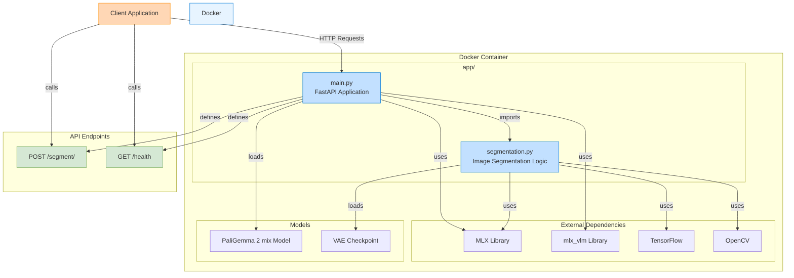

# PaliGemma-Image-Segmentation

An app for performing image segmentation with PaliGemma 2 mix

---

- mlx-vlm, mlx -> PaliGemma 2 mix
- Docker
- FastAPI

---

Structure:

```
project_folder/
├── app/
│   ├── main.py
│   └── segmentation.py
├── models/
│   └── vae-oid.npz
├── .dockerignore
├── .gitignore
├── Dockerfile
├── README.md
└── requirements.txt
```

---

Workflow Overview:


App Architecture:


