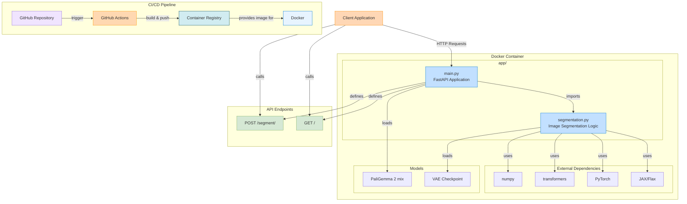
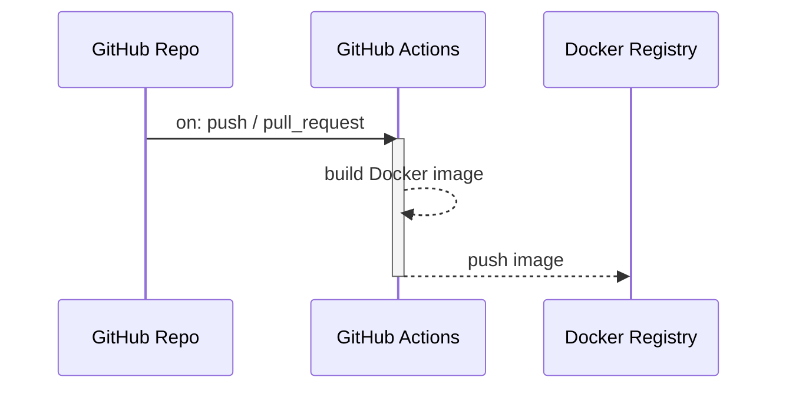
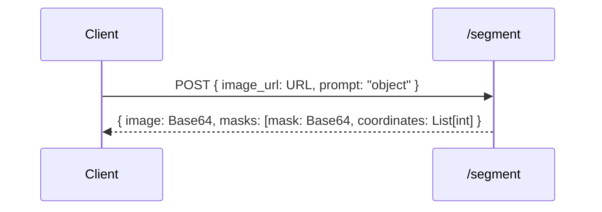
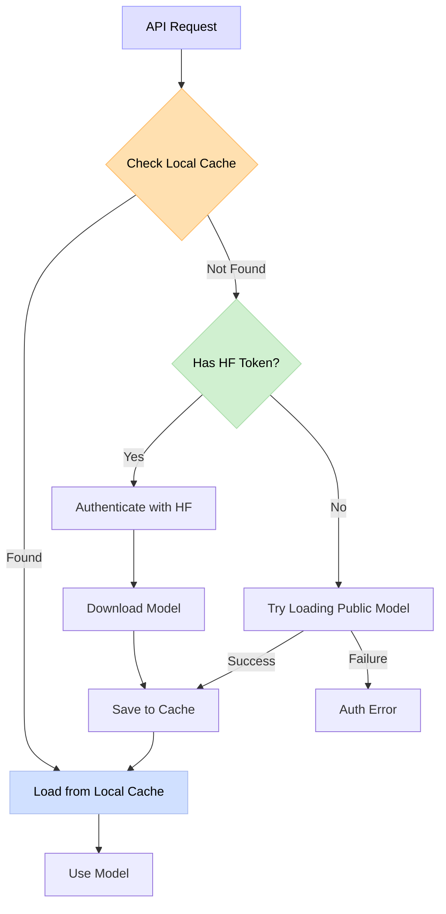

# PaliGemma-Image-Segmentation

An API service for performing image segmentation based on text prompts using Google's **PaliGemma 2 mix** model, built with FastAPI, JAX/Flax, and Transformers. Designed for easy deployment via Docker and Docker Compose.

## Overview

This project provides a FastAPI service that leverages PaliGemma 2 mix to perform image segmentation based on text prompts. The service accepts an image (via URL or file upload) and a text prompt describing what to segment, then returns the segmentation masks and bounding box coordinates. The exact PaliGemma 2 model can also be specified.

## Features

- 🖼️ Image segmentation using natural language prompts
- 🔍 Support for both image URLs and uploaded image files
- 🎭 Returns base64 segmentation masks with bounding box coordinates, and the corresponding base64 model input image
- 🐳 Dockerized for easy deployment
- 🔄 Multi-architecture support (amd64/arm64)
- 🚀 CI/CD pipeline with GitHub Actions for automated container builds and registry publishing

The application uses:

- **PaliGemma 2 mix**: A vision-language model capable of understanding both images and text
- **VAE Model**: For decoding segmentation tokens into pixel-level masks
- **JAX/Flax & Transformers**: Scalable model execution and inference, JAX/Flax is used for the VAE model.
- **FastAPI**: For providing a robust REST API
- **Docker**: For containerized deployment
- **GitHub Actions**: For CI/CD pipeline and automated builds and Docker registry publishing

## Architecture Overview

### Workflow Overview:

```mermaid
graph LR
    User([User]) -->|Uploads Image| Client[Client Application]
    User -->|Provides Prompt| Client
    
    Client -->|HTTP POST Request| API[FastAPI Service]
    API -->|Process Image| PaliGemma[PaliGemma Model]
    PaliGemma -->|Generate Segmentation| VAE[VAE Model]
    VAE -->|Create Masks| API
    
    API -->|JSON Response| Client
    Client -->|Display Results| User
    
    Developer([Developer]) -->|Push Code| GitHub[GitHub Repository]
    GitHub -->|Trigger| Actions[GitHub Actions]
    Actions -->|Build & Push| DockerHub[Docker Hub]
    DockerHub -->|Pull Image| Deployment[Deployment]
    Deployment -.->|Run| API
    
    style User fill:#f9d5e5,stroke:#d64161,stroke-width:2px
    style Developer fill:#f9d5e5,stroke:#d64161,stroke-width:2px
    style Client fill:#eeeeee,stroke:#333333
    style API fill:#b5e7a0,stroke:#86af49
    style PaliGemma fill:#b8e0d2,stroke:#6a9c89
    style VAE fill:#d0e1f9,stroke:#7fa6bc
    style GitHub fill:#f0e4ff,stroke:#9370db
    style Actions fill:#ffd8b1,stroke:#ff9800
    style DockerHub fill:#d1ecf1,stroke:#0c5460
    style Deployment fill:#ffecb3,stroke:#d1b000
```



### App Architecture:



## Project Structure

```
project_folder/
├── app/
│   ├── __init__.py
│   ├── main.py            # FastAPI application and endpoints
│   └── segmentation.py    # Image segmentation logic
├── models/
│   ├── huggingface/       # Cache directory for Hugging Face models
│   └── vae-oid.npz        # VAE model for mask generation
├── .dockerignore
├── .github/
│   └── workflows/         # GitHub Actions for Docker build and push
│     └── docker-build.yml # Workflow to build and push Docker images
├── .gitignore
├── docker-compose.yml
├── Dockerfile
├── README.md
└── requirements.txt
```

## Installation & Setup

### Prerequisites

- Docker
- Hugging Face token: for accessing the Paligemma gated models 

### Setup with Docker Compose

1. Clone this repository
2. Ensure your Hugging Face token is stored at `$HOME/.cache/huggingface/token`
3. Run the application:

```bash
docker-compose up -d
```

> [!WARNING]
> Be careful not run the application as a root user.

The above command will pull the Docker image and run the FastAPI service.

## Environment Variables

The application can be configured using the following environment variables:

- `MODEL_ID`: Spceified PaliGemma model (default: "google/paligemma2-3b-mix-448")
- `MODEL_DIR`: Directory for caching transformer models (default: "/app/models")

> [!NOTE]
> `MODEL_ID` can also be set through the FastAPI `/segment` endpoint.

## Volume Mounting

The models are stored in a persistent volume that is mounted to the container. This allows:

- Models to be reused between container restarts
- Models to be shared between multiple containers
- Models to be easily updated or replaced

The default mount point is `$HOME/.cache/huggingface/hub:/app/models/huggingface` which maps the local `$HOME/.cache/huggingface/hub` directory to `/app/models/huggingface` in the container.

## CI/CD Pipeline

This project uses GitHub Actions:

- On every push to the main branch, the workflow is triggered
- The workflow builds a Docker image for multiple architectures (amd64/arm64)
- The image is pushed to the Docker container registry
- The image is tagged with the commit SHA and 'latest'
- This image can be pulled and used in various scenarios



To use the CI/CD pipeline:

- Fork or clone this repository
- Set up the necessary secrets in your GitHub repository settings:
   - `DOCKERHUB_USERNAME`: Your Docker Hub username
   - `DOCKERHUB_TOKEN`: Your Docker Hub access token
- Push changes to trigger the workflow

## Examples

Base URL: http://localhost:8000

API docs: http://localhost:8000/docs

### Check if the application is running: GET Request

```
GET http://localhost:8000/
```

**Request:**

```python
import requests

response = requests.get("http://localhost:8000/")
print(response.json())
```

**Response:**
```json
{
    "message": "Welcome to the PaliGemma Segmentation API!"
}
```

## Segmenting an Image: POST Request

```
POST http://localhost:8000/segment
```

Form parameters:
- `prompt` (str): Text description of objects to segment
- `image_url` (str, optional): URL of the image to segment
- `image_file` (UploadFile, optional): Uploaded image file to segment
- `model_id` (str, optional): Model ID to use for segmentation

### Image URL Request:



**Python requests:**

```python
import requests

data = {
    "prompt": "segment left wheel",
    "image_url": "https://huggingface.co/datasets/huggingface/documentation-images/resolve/main/transformers/tasks/car.jpg"
}
response = requests.post("http://localhost:8000/segment", data=data)
print(response.json())
```

### Image File Request:

**Python requests:**

```python
import os
import requests

segm_url = os.path.join("http://localhost:8000/", "segment")
image_path = "bl_cat.png"

with open(image_path, "rb") as image_file:
    data = {
        "prompt": "segment cat"
    }

    files = {
        "image_file": (os.path.basename(image_path), image_file, "image/jpeg")
    }
    
    response = requests.post(segm_url, files=files, data=data)
    print(response.json())
```

**Response:**

```json
{
  "image": "base64_encoded_image_data",
  "masks": [
    {
      "mask": "base64_encoded_mask_data",
      "coordinates": [0, 0, 10, 10],
    }
  ],
}
```

## Specify the PaliGemma 2 Model

You can specify the PaliGemma 2 model:

- **At runtime via API**: Pass the `model_id` parameter to the API endpoint
- **Via Docker environment variable**: Set `MODEL_ID`

> [!NOTE]
> If both `model_id` and `MODEL_ID` are set, then `model_id` takes precedence.

If the model is not found in the cache, it will be downloaded automatically.

<div style="width: 200px">


</div>
