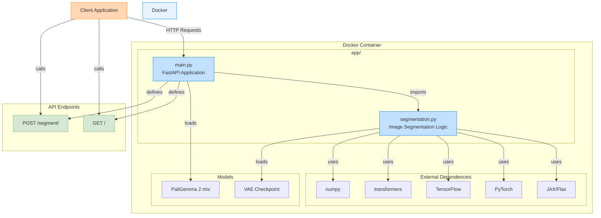

# PaliGemma-Image-Segmentation

An app for performing image segmentation with PaliGemma 2 mix

---

- transformers, JAX/Flax -> PaliGemma 2 mix
- Docker
- FastAPI

---

Structure:

```
project_folder/
├── app/
│   ├── main.py
│   └── segmentation.py
├── models/
│   └── vae-oid.npz
├── .dockerignore
├── .gitignore
├── Dockerfile
├── README.md
└── requirements.txt
```

---

Workflow Overview:


App Architecture:



# Examples:

API docs: http://localhost:8000/docs

## Check if the API is running: GET Request

Request:

```bash
curl -X 'GET' \
  'http://localhost:8000/' \
  -H 'accept: application/json'
```

Response:

```json
{
    "message": "Welcome to the PaliGemma Segmentation API!"
}
```

## Segmenting an Image: POST Request

Request:

```bash
curl -X 'POST' \
  'http://localhost:8000/segment' \
  -H 'accept: application/json' \
  -H 'Content-Type: application/x-www-form-urlencoded' \
  -d 'prompt=segment%20left%20wheel&image_url=https%3A%2F%2Fhuggingface.co%2Fdatasets%2Fhuggingface%2Fdocumentation-images%2Fresolve%2Fmain%2Ftransformers%2Ftasks%2Fcar.jpg'
```

Response:

```json
{
  "message": [
    {
      "mask": "iVBORw0KGgoAAAANSUhEUgAAAEAAAABACAAAAACPAi4CAAAGCklEQVR4nHVX628UVRQ/5+7sLn1sW7oI5V1oEUWQSCEYP5SHQY2EYGI0RmNITEgTv/nBRND4B2j8avhCVIwJPpDEhKCRAJaHGqgx1BoDBVoosViooc/pzsw95r7vzK53O52Zu/f8zu887rlnEexAZETyImBYqGtsbi43lZvLzXXR6PDVq3cnxBqyq0m9oAfAAAGldGnFho5Vi+bPr88XqBgAJNHE3b6z50bn3GpAygIAY8VcECQND3XufGJlYz5HDIAQSawhDlPXeo8NPAAEy0LigHvML17f3lRqKS9d0VqEHBAqkvqOwCt3fvj0SiUlDw4AC10vdrcFRVagXIBIUg6V2UKr5DE9+sWRIZ5loQau/3xkNqrEcRInScK5uMwg8SHOiZKJb3cUoOZoOjhS4ZTwhCcZACIFIC+a699fqiWP234KuRATEGJ4BCSGYCAfkuH3WmsALPhwnIslkkJGXCOYp+Tv96sRcHd/pPT6tlsPKAbKFE585B1nBVNxWP11SFo8DWAdYB3BiaKRnqJVjeJ/48F7iaZYpd4zQZtBPLmyJ2cRADC/e6CKeEreUJAIgkrU+5RFAMD2r0JF9n+GyQJphhrhN51MugAAoLCrOy9MqZVeqZtIRj1ReGZ/ycxix+lI+dlxSLExYTCuVMEcfimvGeR2bgo85cIpbt8rrWTfyXBgS95YqQHa9tYLKZJ/cp/IrYM2SIgopiWOpk0EQfdzRQWweXOgZOQaa6msAz4Pa7L8CNe1ogBofF4kpiKtsiJjRhpIzCs2ua51AiDXuS3QM2rbG/aywGXFnaMQsXVLHhjg1iXOeqFVKyZQRU/OkPSi+F65U7iMYN7GecCwYXOReXb6ZVdrJ1UWpRN0tugCtaoMDJdtMI5F7R3lCGGQ9KnxixIWAbE2Ll8KjD2yjInypxznh5/0Whs751TJDglK7Sworm01kbecIf1oYKUGScMcCXVrA1buClIyarGjreOS8ZEwFwjYYw1BZ6cEUGZLcRUNPaGi7lTobNJ3/vAitqs9myrSGkNbWOd9S8Ij+lhDIFbexLYX9QknfaX0qtDLu7NKPup8NTmGLd2sPcDMcWn8pfFMVur4e3yRMNjCGiRLFW6Zn5qqTD4ro/CsVRYN25jLwtRwhtsc8EMruSIAq2MzYkOaqPk73s6ouqDmjY+0dUSMXU+4n2PWThs79aTDauwxd4zZybuRK1MWSMRZe1FtIS8dTD4KND7GTv0cGQsse/PqqpN2oV1oFFYusj9PDCXW0TqP/VDKoeuBxpJAMgzRyI9sqvdyYhPXoym0eO2Ll60uMajyfS+Lx34PbYK5OEmyWq/JTRd+lc8sOv/ZGIPZi8NJ1Tb2akjqbrHFVDxwuD9mQLcGeTryUoMuWmYTuu/ldhI+4COHT1ZEKzh5KfJjJPPMFVdRq21eWnYEyGeOHZ8WXSnN/nZPq7PpIXWozPNLoJpTq3h89pNRebQhXfvLN0EpSSWOrTPO0cSvfyzFGBGMnQ/9wmFutqwpIjqqotgIgPHD57lAZAAQnrstK4zeNtZvxt8+D5XIiNNfHp1yR0jLR1Op/sDrAmoM8VXlxEavR2Jsx4BZq/si09DVkibO53qfLfopgs0Hx2PXlyglGXHT7IpecvbSq42ZI7vzyKRuvzSM7qk8APuehBdeL3ktmhiY3/rdTLpFSss6UB5Pnnm5CapGbucF0WhJCvJK07cUePTP0adte+aP+r19s65D8x1g+0Nxm7vxwaP6LHQDpSfrX/sjVF26C2aKgJifPLNvoZdffrIBNPQMzdn1NUd069CmeqM0u1MAoOXNG3NJVdwtYjJx9pWy876rG2inSm/fqeie3PblBiGZ6Tuwrob16VF+dzhMdBj8iPLw/qm3HrfJlxrov+QWHhgMUz9vhPuT8PbxfWuqz0BdH8CfYot7Lt6XCWECGsX/9h/a0xbU7hdtGOxZxRo2vrCrI6/WE0bxvcvnTg9O1xL22x/vlyhjC7q2P7m8uRBwmn1w85df+8bDzMFjjddnlupZLA/EQsvqNSsW1cWTt24Ojk7xxCxnPP0rAJAY/w8S4aoJWJDmVQAAAABJRU5ErkJggg==",
      "coordinates": [
        62,
        254,
        140,
        348
      ]
    }
  ]
}
```
